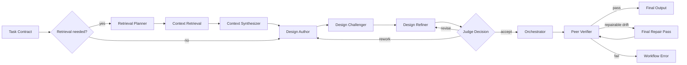

# crisAI Documentation

> **Operator manual for the local AI workstation.**
>
> This guide explains what crisAI is, how it is structured, how the CLI behaves, how routing works, how models are assigned, and how to use it effectively.

---

## 1. What crisAI is

crisAI is a local AI workstation for:

- architecture work
- technical design
- documentation drafting
- research and retrieval
- source inspection
- diagram generation
- SharePoint / OneDrive discovery
- intranet **site page** retrieval on configured SharePoint sites
- controlled multi-agent critique

It is designed to behave like a practical workstation rather than a black-box chatbot.

That means:
- you can inspect the available agents
- you can inspect the available MCP servers
- you can control the execution mode
- you can pin or unpin the target agent
- you can keep persistent session histories
- you can choose your review preference
- you can see when routing is automatic versus pinned
- you can assign different providers and models to different agents through configuration

The product vision is recorded in `reference/VISION.md`. Product and engineering
design decisions about crisAI itself are recorded under `reference/decisions/`.
The maintainable improvement backlog is recorded in `reference/TODO.md`. Keep
customer/domain architecture knowledge in `workspace/knowledge/` instead.

---

## 2. Mental model

crisAI has five main moving parts:

### 2.1 App surfaces
- **CLI**: interactive shell where you type slash commands and prompts.
- **Web**: browser interface with session history and progressive workflow tabs.

### 2.2 Agents
Specialist reasoning roles such as:
- `retrieval_planner`
- `context_retrieval`
- `context_synthesizer`
- `design`
- `summary`
- `review`
- `operations`
- `document_formatter`
- `orchestrator`
- peer-only roles such as `design_author`, `design_challenger`, `design_refiner`, and `judge`

### 2.3 MCP servers
Tool adapters that let agents interact with the outside world.

Typical examples:
- local workspace server
- document reader server
- diagram server
- vision server for standalone images and embedded PowerPoint pictures
- document export server for DOCX/PPTX rendering from reviewed Markdown
- SharePoint / OneDrive documents server
- intranet **site pages** server (scoped to `registry/intranet.yaml`; **independent** Graph auth token cache from the SharePoint docs server)

### 2.4 Router
A lightweight heuristic layer that decides which agent or mode is most suitable when you have not explicitly chosen one.

The router distinguishes between:
- **auto routing**
- **pinned mode**
- **pinned agent**

### 2.5 Request and task contracts
Before routing, crisAI infers a small runtime **Request Contract** that combines the user’s workflow preference, source obligations, named sources, output path, required actions, and quality gates.

The Request Contract wraps the existing **Task Contract**, which preserves the user’s main ask across agent handoffs. The router chooses the workflow from the contract rather than from isolated keyword scores. For example, a request to summarise the latest matching deck is treated as a summary deliverable with a supporting source-resolution step, not as a candidate-ranking task. A request to create an artefact from a SharePoint page is treated as source-backed generation, while a request to format an existing Markdown artefact with a workspace template remains a formatting task.

### 2.6 Model registry
Agents do not need to hard-code provider model names anymore.

Instead:
- agents reference a logical `model_ref`
- `registry/models.yaml` defines the real provider and model mapping
- the runtime resolves the correct provider-specific model for each agent

This allows examples such as:
- `retrieval_planner` → OpenAI
- `judge` → Gemini
- `design_challenger` → Anthropic

### 2.7 Installation and virtual environment

crisAI is meant to run from a **local Python virtual environment** named **`.venv`** at the project root. The **`./start`** script activates `.venv` for both CLI and web; if `.venv` is missing, it prints short setup commands and exits.

First-time setup (full step-by-step, including `.env`, is in the repository **README**):

1. Create and activate the venv, for example:
   ```bash
   python3 -m venv .venv
   source .venv/bin/activate
   ```
2. Install dependencies, for example:
   ```bash
   pip install --upgrade pip
   pip install -e ".[litellm]"
   ```
   or `pip install -r requirements.txt` (same default multi-provider install).
   Use `pip install -e .` only when you have changed `registry/agents.yaml` to an
   OpenAI-only configuration.

On **Debian / Ubuntu**, if `python3 -m venv` fails with a message about **`ensurepip`** or **`python3.x-venv` missing**, install the OS **`venv`** package for your Python version (e.g. `sudo apt install python3-venv` or `python3.12-venv`).

You can also use **`scripts/bootstrap.sh`**, which creates `.venv` if needed and runs `pip install -r requirements.txt`.

---

## 3. Starting crisAI

From the project root (after `.venv` exists and dependencies are installed):

```bash
./start cli
```

Recommended startup behaviour:
- do **not** force `--pipeline` in the launcher
- let the router decide unless you explicitly pin a mode or agent later

When crisAI opens, you are inside the interactive CLI.

To run the web interface:

```bash
./start web
```

Then open [http://127.0.0.1:8000](http://127.0.0.1:8000).

---

## 4. First things to try

Inside the CLI:

```text
/help
/status
/list servers
/list agents
```

These are the best first commands because they show you:
- what tooling is available
- what specialist reasoning roles exist
- whether routing is currently auto or pinned
- which models are assigned to agents by configuration

---

## 5. Slash commands

### Core commands

```text
/help
/status
/list servers
/list agents
/history
/clear
/clear-session
/clear-session architecture
/session architecture
/session new architecture-v2
/session compact
/context show
/context reset
/exit
```

Outside interactive chat, you can reset a persisted session directly:

```bash
crisai clear-session --session architecture
```

Structural checks on promoted knowledge, staged knowledge, and task Markdown (`workspace/knowledge/`, `workspace/knowledge_staging/`, and `workspace/tasks/`) are driven by **`registry/workspace_artifact_profiles.yaml`**. The first matching profile (by declare order) supplies rules on top of `defaults`; front-matter **`type`** can be spelled with synonyms listed under `type_aliases` (for example **`HLD`** maps to **`high_level_design`**). Run validation manually:

```bash
crisai doctor
crisai validate-artefacts
crisai validate-artefacts -p workspace/knowledge_staging/patterns/example.md
```

`crisai doctor` validates registry cross-references, prompt paths, semantic and deterministic retrieval registry shape, provider key warnings, and tracked secret/cache hygiene. Use `crisai doctor --models` after changing `registry/models.yaml` or agent `model_ref` values; it dry-builds configured agent models through the runtime factory without opening MCP servers or calling provider APIs.

The same validator runs automatically as part of the **peer post-run verifier** for Markdown files touched in that workflow (`src/crisai/orchestration/peer_verifier.py` calling `validate_workspace_artefact_paths`).

### Mode controls

```text
/mode auto
/mode single
/mode pipeline
/mode peer
```

### Review controls

```text
/review on
/review off
```

### Verbose controls

```text
/verbose on
/verbose off
```

With **`/verbose off`** (the usual default for readable transcripts), pipeline and peer **stage output** is shown as **compact Markdown**: short headings, bullets, and recaps rather than dumping full raw model text. Machine handoffs such as evidence bundles, task contracts, and retrieval planning payloads are hidden from normal stage panels. Turn **`/verbose on`** when you need fuller readable stage bodies for debugging; raw machine contracts are still stripped from stage rendering and retained as structured metadata in `logs/agent_trace.jsonl`.

### Retrieval checkpoint controls

Pipeline retrieval checkpoints are enabled by default. After `context_retrieval`
returns validated evidence, crisAI pauses before summary, design, review, or
orchestration stages. The user can continue with the evidence, redirect
retrieval with extra guidance, or stop before spending more tokens.

```text
/retrieval-checkpoint on
/retrieval-checkpoint off
```

For one-off CLI requests, use `--retrieval-checkpoint` or
`--no-retrieval-checkpoint`. The web app exposes the same setting as a checkbox
in the prompt workspace. Defaults are controlled by:

```text
CRISAI_RETRIEVAL_CHECKPOINT_ENABLED=true
CRISAI_RETRIEVAL_CHECKPOINT_MAX_REDIRECTS=2
```

### Session memory controls

Each task session stores raw history, compact memory, and task metadata under `workspace/tasks/<task>/.crisai/`. Legacy `workspace/chat_sessions/` files are still read for compatibility. Runtime prompts use the compact memory plus a small relevant recent tail instead of replaying the full session, which reduces repeated context and token waste during multi-step tasks.

Use one session per task when possible:

```text
/session new integration-summary
/context show
/session compact
/context reset
```

- `/session new <name>` starts a clean task session and creates `workspace/tasks/<name>/`.
- `/session <name>` switches to an existing task session and loads its raw history.
- `/session compact` rebuilds compact memory from the raw history.
- `/context show` previews the compact memory and recent-turn budget that would be supplied to the next request.
- `/context reset` clears compact memory while keeping raw history intact.

Session memory defaults are configured in `registry/session_memory.yaml`. Local operators can override those defaults from `.env` without editing registry files:

```dotenv
CRISAI_SESSION_MEMORY_STRATEGY=deterministic
CRISAI_SESSION_MEMORY_AGENT_ID=memory_summarizer
CRISAI_SESSION_MEMORY_MAX_RECENT_TURNS=2
CRISAI_SESSION_MEMORY_MAX_RUNTIME_CHARS=6000
CRISAI_SESSION_MEMORY_MAX_MEMORY_CHARS=3000
CRISAI_SESSION_MEMORY_TASK_DRIFT_NUDGE=true
```

The default strategy is deterministic, with bounded memory and recent-turn budgets. `memory_summarizer` is registered as the dedicated summarization role for future agentic compaction, but normal runtime compaction currently uses the deterministic contract for predictable cost and offline tests.

### Agent controls

```text
/agent auto
/agent retrieval_planner
/agent design
/agent review
/agent operations
/agent orchestrator
```

### Important behaviour

- `/mode ...` pins the mode when you choose `single`, `pipeline`, or `peer`
- `/mode auto` clears the mode pin and returns control to the router
- `/agent ...` pins the agent
- `/agent auto` clears the agent pin and returns agent choice to the router
- `/status` prints the current chat state, including:
  - session
  - routing mode state
  - agent state
  - review preference
  - verbose setting
  - history count

---

## 6. Reading chat state

Typical examples:

```text
Routing: auto | Agent: auto
```

Meaning:
- the router is free to decide the most suitable mode and agent

```text
Routing: pinned:peer | Agent: auto
```

Meaning:
- mode is explicitly pinned to `peer`
- the router is still free to infer details such as retrieval need

```text
Routing: auto | Agent: pinned:design
```

Meaning:
- agent is explicitly pinned to `design`
- the router should not auto-select a different agent

---

## 7. Modes

### 7.1 `single`
Use one agent directly.

Best for:
- pure source lookup (finding documents only)
- direct design drafting
- review only
- operations/debug
- bounded/simple tasks where one specialist is enough

### 7.2 `pipeline`
Structured flow:

```text
task_contract -> retrieval_planner -> context_retrieval -> retrieval_checkpoint -> context_synthesizer -> summary|design -> review -> orchestrator
```

With retrieval checkpoints enabled, the pipeline pauses after
`context_retrieval` and before the downstream stages. A redirect reruns
`retrieval_planner` and `context_retrieval` with the user's extra guidance,
bounded by `CRISAI_RETRIEVAL_CHECKPOINT_MAX_REDIRECTS`.

For source-summary requests, the pipeline uses a shorter path after validated
`content_read` evidence:

```text
task_contract -> retrieval_planner -> context_retrieval -> retrieval_checkpoint -> summary
```

The skipped context/final stages are traced as skipped events; the summary agent
output is returned as the final answer.

Best for:
- find source material
- turn source material into a draft
- summarise source material without letting source selection become the final answer
- critique and polish complex retrieval+drafting outputs with a mandatory review gate on that route

### 7.3 `peer`
Collaborative critique flow:

```text
optional retrieval_planner -> optional context_retrieval -> optional context_synthesizer -> design_author -> design_challenger -> design_refiner -> judge -> [refiner <-> judge iterative loop when decision=revise] -> [author -> challenger -> refiner escalation when decision=rework] -> orchestrator -> peer_verifier
```



Notes:
- `retrieval_planner` and `context_retrieval` can be skipped when retrieval is not needed for the peer task.
- when retrieval is needed and the agent is configured, `context_synthesizer` runs after context retrieval to provide a stronger evidence basis for peer stages.
- peer mode now compiles a run contract from the user request (expected output type, required side effects, grounding needs, acceptance dimensions) and injects it into peer role prompts.
- contract inference prefers `artifact_package` for file-backed staging requests (for example `knowledge_staging` or task artefact deliverables) unless the request includes clear code targets (`src/`, `tests/`, language file extensions, or explicit code symbols).
- judge output is actionable: `Decision: revise` triggers bounded extra refiner/judge rounds (`CRISAI_PEER_MAX_REFINEMENT_ROUNDS`, default `2`) before orchestration.
- `Decision: rework` means the issue is structural; peer mode runs a bounded author/challenger/refiner escalation driven by judge feedback (`CRISAI_PEER_MAX_ESCALATIONS`, default `1`).
- when revise loops remain unresolved, peer mode also runs the bounded structural escalation (`design_author` + `design_challenger` + `design_refiner` + `judge`).
- accepted peer output still passes through a post-run verifier that checks file-backed claims against on-disk artefacts (for example referenced files exist, markdown shape is present, front-matter ids are unique, and claimed mismatch notes are actually written).
- peer finalization is hard-gated: if judge does not return `accept` after the allowed loop, the run fails before orchestrator final recommendation.
- peer final prompts include a runtime changed-file manifest and require verbatim path reuse in close-out sections.
- verifier also checks close-out fidelity against changed files and flags gap/leaf contradictions in staged markdown packages.
- retrieval-gaps markdown files are exempt from mandatory `## Source` sections; semantic leaf/index artefacts still require source sections.
- if verifier failure is limited to final-text reference/close-out drift, peer mode runs one bounded final-output repair pass and re-verifies before hard failing.
- loop safeguards: max rounds bound, and a convergence guard that stops early when refiner output stops changing materially.
- workflow policy gates still apply in peer mode (see section 9.1): requests that require intranet-grounded evidence or filesystem side effects can fail fast when those outcomes are missing.

Best for:
- debated design work
- more rigorous challenge and refinement
- higher-effort architecture shaping

### 7.4 Choosing the right mode for architecture work

crisAI is a support tool for Solution Architects, Data Architects, and
Enterprise Architects. Its role is to accelerate daily architecture work by
turning approved context, retrieved evidence, and UCL templates into
high-quality customised drafts. It should improve first drafts, expose gaps,
and prepare material for review; it does not replace architect accountability
for final decisions, stakeholder alignment, or publication.

Use this rule of thumb:

| Task shape | Preferred mode | Why |
|---|---|---|
| Find documents, list sources, inspect a known artefact, or answer a bounded factual question | `single` or `pipeline` | The task is mainly retrieval or direct execution; peer challenge adds cost without much value. |
| Summarise a document, deck, intranet page, or evidence set | `pipeline` | The main risk is source selection and content-read evidence, so the linear retrieval-to-summary path is more efficient. |
| Create a UCL-customised first draft from known context, such as a meeting note, HLD skeleton, design note, or briefing | `pipeline` | The output depends on grounding and template alignment more than adversarial reasoning. |
| Produce an options paper, ADR, target-state recommendation, roadmap, or operating-model proposal | `peer` | The output depends on judgement under ambiguity; author/challenger/refiner/judge separation should improve trade-offs and defensibility. |
| Review a solution, data design, integration approach, migration plan, or governance model where weak assumptions could be expensive | `peer` | Independent challenge is useful for surfacing hidden coupling, missing NFRs, ownership gaps, risks, and weak evidence. |
| Convert or format a generated Markdown artefact into a UCL Word or PowerPoint template | `single` with `document_formatter`, or `pipeline` when source retrieval is also needed | The task is formatting and template alignment, not architecture debate. |

Use `pipeline` when the work is mostly **source-to-draft**:

- summarise the latest architecture deck
- produce a UCL-style HLD skeleton from retrieved notes
- draft a design section from approved workspace knowledge
- prepare a concise architecture briefing from intranet guidance
- extract requirements, constraints, or risks from documents

Use `peer` when the work is **judgement under ambiguity**:

- choose between integration patterns, data platform options, or reporting architectures
- write or challenge an ADR for a contentious design choice
- assess a target-state architecture against enterprise principles
- review data governance, MDM, data quality, lineage, or security models
- test migration sequencing, transition states, operating model, or ownership assumptions

The expected output difference is practical:

- `pipeline` should be faster, cheaper, and better for faithful source-grounded drafts.
- `peer` should produce stronger rationale, clearer rejected alternatives, better risk and assumption coverage, and more defensible recommendations.

Do not use `peer` just because a task is important. Use it when the important
part is the quality of the architectural judgement, not merely accurate
retrieval, summarisation, or formatting.

---

## 8. Agents

### `orchestrator`
General coordinator and safe fallback.

### `retrieval_planner`
Plans a compact retrieval handoff (search angles, paths, constraints) before **Context Retrieval** fetches sources. Does not retrieve documents itself.

### `context_retrieval`
The evidence retrieval specialist for local context chunks and source-grounded extracts.

### `context_synthesizer`
The context structuring specialist that turns retrieved evidence into a grounded brief for the next deliverable agent.

### `design`
The drafting and architecture specialist.

### `summary`
The summary specialist. It produces document, deck, page, file, or pasted-text summaries from content that was actually read or directly supplied. If retrieval had to resolve the best source, source-selection rationale stays brief and secondary.

### `review`
The critique specialist.

### `operations`
The troubleshooting specialist.

### `design_author`
The peer-mode authoring specialist. Produces the initial design proposal that the challenger and refiner then work from.

### `design_challenger`
The peer-mode adversarial specialist. Stress-tests assumptions and identifies weaknesses in the author's proposal.

### `design_refiner`
The peer-mode synthesis specialist. Reconciles the author's proposal with the challenger's critique into an improved position.

### `judge`
The peer-mode arbitration specialist. Evaluates the full author → challenger → refiner exchange, rules on the strongest position, and produces the final peer verdict.

### `publisher`
The packaging specialist for turning approved outputs or user requests into more formal artefacts when supported by the available tools.

### `document_formatter`
The narrow export specialist for transforming an existing reviewed Markdown task artefact into a native DOCX or PPTX file using a template manifest. It preserves source content, reports missing required sections, and writes only to `tasks/<task>/exports/` or `outputs/`.

---

## 9. Heuristic router

crisAI includes a Phase 1 heuristic router.

Its purpose is simple:
- if you have not explicitly chosen a mode or agent, it picks a sensible route

### 9.1 Runtime workflow policy gates

Before routing, crisAI builds `request_contract_v1` from the registry-driven task contract, deterministic retrieval context, explicit mode patterns, source-scope markers, named source references, and workspace output paths. Routing then uses this normalized contract to decide whether the request is retrieval-only, source-backed drafting, summary, peer review, publication, document formatting, or operations.

After routing selects a mode/agent path, crisAI applies a generic runtime policy layer from `registry/workflow_policy.yaml`:

- infer capabilities from request text (for example `intranet_grounded`, `produce_artifacts`)
- map capabilities to hard requirements (for example intranet fetch evidence, workspace file writes)
- use explicit workspace output paths from the Request Contract as the write target when present
- fail the run with a clear error when required outcomes are missing

This keeps behaviour generic and guardrail-driven, instead of relying only on prompt compliance.

For peer mode specifically, there are two additional runtime guardrails:
- `peer_contract`: inferred from the user request and used to focus author/challenger/refiner/judge on deliverable-level outcomes.
- `peer_verifier`: validates final peer claims against filesystem state before the run is considered successful.

### 9.2 External semantic configuration

Task and retrieval semantics are configurable from `registry/semantic_graph.yaml`:

- task intent facts such as `primary_intent`
- deliverable facts such as `deck_summary` or `document_summary`
- source-resolution facts such as `latest_matching_source`
- source-family hints such as `intranet` or `sharepoint_docs`
- retrieval topic expansion terms and graph edges

The legacy router, peer-contract, and verifier semantics remain configurable from `registry/semantic_catalog.yaml`:

- router term families for non-task-contract routing (discovery/design/review/operations/peer/publication)
- router criticality terms for high-accuracy/high-risk prompts that can promote complex design/review asks to peer mode
- explicit routing phrase patterns
- source and architecture-location marker lists
- shared prompt lexicon (`lexicon`) for language-level function words, prompt-noise words, and title-relation words used by deterministic parsers
- retrieval source-fit constraint vocabulary (`retrieval_constraints`) for retrieval-specific object type terms and source-scope markers
- Request Contract source-family and source-scope inference through `retrieval_constraints.source_scope_markers`
- peer-verifier regex patterns (for example gap-line and leaf-file matching)
- peer-verifier semantic leaf-file terminology (`leaf_file_terms`) to classify architecture-oriented deliverables by filename terms (for example `patterns`, `template`, `hld`, `guides`, `standards`, `principles`, `toolkit`)
- **peer_contract** marker phrase lists (`file_write_markers`, `code_change_markers`, `code_target_markers`, `grounding_markers`, `assessment_markers`) used by `infer_peer_run_contract` (substring match on lowercased user text; inference logic stays in code)

Standalone function words such as `in`, `on`, `for`, `a`, and `an` belong in `lexicon.function_words`, not in graph vertices or feature-specific semantic lists. Multiword graph terms may still contain function words when the whole phrase carries semantic meaning, for example `principles of integration`.

The semantic catalogue loader reads **only** `registry/semantic_catalog.yaml` for its legacy scope. A missing file raises `FileNotFoundError`; invalid YAML or a shape that fails validation raises `SemanticCatalogError` with a field-level message. Restart processes after edits so registry changes are reloaded.

This keeps semantic/heuristic tuning maintainable outside code, similar to `registry/search_synonyms.yaml`.

### Typical routing examples

| Prompt type | Likely route |
|---|---|
| Find documents only | `single` + `retrieval_planner` |
| Summarise a matching document/deck | `pipeline` + `summary` |
| Find documents and draft a note | `pipeline` + review |
| Create an artefact from a SharePoint/intranet source | `pipeline` + `retrieval_planner` |
| Format an existing Markdown artefact with a workspace template | `single` + `document_formatter` or `publisher` |
| Propose and critique a design | `pipeline` with review |
| Review this draft | `single` + `review` |
| Why is SharePoint login popping up? | `single` + `operations` |
| High-criticality/high-accuracy design request | `peer` |
| Broad mixed request | `pipeline` + `design` + review |
| Ask for author/challenger/refiner/judge debate | `peer` |

### Important rule

A default startup state should **not** count as a user-explicit mode selection.

---

## 10. Reading router output

You may see messages such as:

```text
[router:auto] single • retrieval_planner • review:off • retrieval:on • Prompt primarily asks for finding or inspecting sources.
```

Or:

```text
[router:pinned] peer • design_author • review:on • retrieval:off • Prompt requests peer-style proposal, challenge, refinement, and judgement.
```

This makes the router behaviour inspectable rather than hidden.

---

## 11. Retrieval discipline

This is one of the most important parts of crisAI.

### Core rules

- never guess file paths
- never guess site names
- never guess drive IDs
- never guess item IDs
- always list or search before read
- only inspect things returned by the current run
- when retrieval fails, report the actual tool failure

For architecture and documentation work, trustworthy retrieval matters more than sounding clever.

---

## 12. Workspace usage

crisAI separates team-owned knowledge from task-owned work:

```text
workspace/knowledge/                  approved, team-owned, machine-readable corpus
workspace/knowledge_staging/          review area for knowledge promotion candidates
workspace/tasks/<task>/.crisai/       task manifest, history, and compact memory
workspace/tasks/<task>/artefacts/     Markdown/Mermaid source artefacts generated for the task
workspace/tasks/<task>/inputs/        task-specific source files
workspace/tasks/<task>/scratch/       temporary notes
workspace/tasks/<task>/exports/       generated native exports from reviewed Markdown
workspace/outputs/                    generic tool outputs
```

`registry/workspace_spaces.yaml` owns the canonical root names, writable roots, task subdirectories, promotion roots, and enterprise-architecture vocabulary. Keep semantics there rather than hard-coding new workspace categories in Python.

Agents may write task artefacts directly under the active task and may write knowledge promotion candidates under `knowledge_staging/`. Agents should not write directly to `knowledge/` unless a specific promotion workflow has been requested and validation passes.

Markdown/Mermaid is the source of truth for generated architecture artefacts. Native Word, PowerPoint, Excel, email, JSON payload, mapping documents, and diagram exports should be generated as follow-on tasks from reviewed Markdown and organisation templates.

DOCX/PPTX exports are handled by the `document_formatter` agent and the
`document_export` MCP server. The expected flow is:

1. Generate or review the source Markdown under `workspace/tasks/<task>/artefacts/`.
2. Select a template manifest under `workspace/knowledge/templates/` or another approved workspace path.
3. Render the native file into `workspace/tasks/<task>/exports/` or `workspace/outputs/`.
4. Treat the returned export report as validation metadata, not user-facing prose unless troubleshooting.

Starter UCL template manifests are available at:

```text
knowledge/templates/ucl/hld/ucl-hld-docx.template.yaml
knowledge/templates/ucl/presentation/ucl-architecture-pptx.template.yaml
```

If an official binary `.docx` or `.pptx` template is available, place it beside
the manifest and reference it with `template_file`. Without a binary template,
the exporter still creates a valid native file from the manifest structure but
cannot apply organisation-specific branding or slide masters.

### Good path style

```text
inputs/strategy.md
tasks/reporting-hld/inputs/strategy.md
tasks/reporting-hld/artefacts/reporting-hld.md
knowledge/reference/template/hld_reporting.md
```

### Bad path style

```text
workspace/inputs/strategy.md
```

Agents should work with paths relative to the workspace root.

The web app exposes `Knowledge`, `Tasks`, and `Staging` browser panes with read/edit support for text-based workspace files. It is intended for quick Markdown edits and review, not as a replacement for a governed document management system.

---

## 13. SharePoint / OneDrive usage

crisAI supports delegated Microsoft Graph access for:
- SharePoint sites
- personal OneDrive
- drives, items, and documents

For SharePoint/OneDrive documents, search and list tools return an opaque
`read_handle` alongside legacy `driveId` / `id` fields. Agents should pass that
handle to `read_sharepoint_document_by_handle` or
`get_sharepoint_document_metadata_by_handle`; they should not infer identifiers
from browser URLs or copy raw IDs between stages.

Retrieval stages provide an `evidence_bundle_v1` machine payload for source
grounding. crisAI parses and validates that payload at the pipeline boundary,
stores it as structured trace metadata, and removes raw JSON from agent prose.
Downstream agents receive a readable **Validated Evidence Summary** instead of a
fenced JSON block. A document/deck/file summary requires at least one item with
`evidence_level: "content_read"`; search hits, metadata rows, and failed reads
are treated as candidates or gaps, not as source content.

For “latest”, “most recent”, or “likely master” source summaries, retrieval
should include the top matching candidate metadata in the evidence bundle. If
the newest modified file and the strongest version/master candidate disagree,
crisAI stops before summarising and asks the user to choose the source. This
prevents the pipeline from silently flipping between date-based and
version-based interpretations.

For source-read summaries, crisAI also infers **source-fit constraints** from
the user request. Explicit title phrases such as quoted text, or phrases before
terms like "document", "deck", or "file", become hard title constraints; explicit
source scopes such as personal OneDrive, SharePoint, intranet, or workspace
become hard source constraints. A `content_read` item must satisfy those
constraints before downstream summary/design stages can use it. Semantic
expansion terms remain optional search hints and cannot override explicit source
fit.

For summary and source-backed generation requests, the pipeline carries both a
`request_contract_v1` machine payload and the nested `task_contract_v1` payload.
The Request Contract tells the runtime which source/read/write gates apply; the
Task Contract tells downstream agents that the main deliverable is the user’s
requested summary, design, template, assessment, or recommendation, and that any
“latest/best candidate” work is only a source-resolution subtask.
Once retrieval has validated `content_read` evidence, source summaries use a
fast path that passes the validated evidence summary directly to the `summary`
agent and returns that output without a separate context synthesis or final
orchestration rewrite.
Machine payloads are retained in traces for debugging but hidden from normal CLI
and web stage panels, verbose panels, and final answers.

JSON Schemas and prompt-facing schema contracts live under
`src/crisai/schemas/`. Python code should load those resources rather than
embedding schema examples or contract blocks directly in modules.

PowerPoint retrieval has dedicated inspection support. Use:
- `inspect_powerpoint_document` for local workspace `.pptx` files
- `inspect_sharepoint_powerpoint_by_handle` for SharePoint / OneDrive `.pptx` files returned by search
- `describe_powerpoint_slide_images` for pictures embedded in workspace `.pptx` files when the `vision` server is enabled

These tools return structured slide records plus extraction metadata:
- `status`
- `slide_count`
- `slides_with_text`
- `coverage`
- `limitations`
- per-slide title, text, tables, and speaker notes when available

Standard `read_document` and `read_sharepoint_document_by_handle` also include a PowerPoint extraction header for `.pptx` files. Current text extraction coverage is text boxes, slide titles, table cells, grouped shape text where exposed by `python-pptx`, and speaker notes when present in the package XML. The separate `vision` server can describe standalone image files and picture shapes embedded in local workspace PowerPoint files, but arbitrary OCR, embedded objects, and some SmartArt can still require manual inspection or future extraction support.

### Vision tools

The **`vision`** MCP server is a local workspace tool server for image inspection. It is useful when a retrieved deck includes diagrams or screenshots that text extraction cannot see.

**Available tools:**

| Tool | Purpose |
|---|---|
| `describe_image` | Describe a standalone workspace image file (`.png`, `.jpg`, `.jpeg`, `.gif`, `.webp`) |
| `describe_powerpoint_slide_images` | Extract picture shapes from a workspace `.pptx` and describe them, optionally filtered by 1-based slide number |

Configuration notes:
- the server is registered as `vision` in `registry/servers.yaml`
- agents need `vision` in their allowed server list before they can use these tools
- paths are workspace-relative and are bounded to the configured workspace root
- the default model is `gpt-4o-mini`; override with `CRISAI_VISION_MODEL`
- descriptions call the OpenAI API, so `OPENAI_API_KEY` must be configured for live use

### Intranet content pages (scoped MCP server)

For **published intranet pages**, use the separate **`intranet`** MCP server — not a generic web browser. The default provider reads modern SharePoint site pages, but the MCP contract is provider-neutral so an organisation can replace it with a wiki or custom intranet adapter.

**Available tools:**

| Tool | Purpose |
|---|---|
| `intranet_list_pages` | Full page catalogue across all configured sources (deterministic; cached when supported) |
| `intranet_search_pages` | Keyword search against configured intranet pages |
| `intranet_fetch_page` | Retrieve full page text by opaque `content_id` |
| `intranet_list_page_links_by_id` | Enumerate child page links from a hub or catalogue page by `content_id` |
| `intranet_login` | Trigger interactive Microsoft Entra authentication for the intranet token cache |
| `intranet_auth_status` | Check authentication status without prompting |

Compatibility aliases remain available for SharePoint-backed deployments: `intranet_list_all_pages`, `intranet_search`, `intranet_fetch`, and `intranet_list_page_links`. New prompts and providers should use `content_id` and the neutral tool names.

**Two-stage search strategy:**

With the SharePoint provider, `intranet_search_pages` runs a two-stage strategy to ensure leaf pages (e.g. `Consumer-Pattern-1`, `Producer-Pattern-2`) are never silently dropped:

1. **OData / scored pass** — Graph OData filter returns the most relevant pages first (fast, capped per site).
2. **Cache expansion** — any pages in the local catalogue that match at least one expanded query token are merged in, deduplicated, up to `max_hits`. This stage only runs when the cache is warm and adds no Graph API calls.

Both stages use **synonym-expanded tokens** (see below), so a search for "integration patterns" automatically includes "integration", "integrate", "integrations", "pattern", and "patterns" as match tokens.

Operational logs for hit counts and fetch sizes are written to **`logs/intranet_mcp.log`** (alongside other MCP logs under `CRISAI_LOG_DIR`).

**Search synonym dictionary (`registry/search_synonyms.yaml`):**

A YAML file of equivalent-term groups loaded once at provider start-up. When any token from a user query appears in a group, all other members of that group are added as additional match tokens. This allows:

- plural/singular pairs: `patterns` → also matches `pattern`
- abbreviations: `hld` → also matches `high-level-design`, `high level design`
- domain synonyms: `integration` → also matches `integrate`, `integrations`

The file is maintained independently of code — add a group when a query consistently misses relevant pages. Restart the CLI to pick up changes. The default path is `registry/search_synonyms.yaml`; override with `search_synonyms_file:` in `intranet.yaml`.

**Semantic graph (`registry/semantic_graph.yaml`):**

Deterministic retrieval uses the registry semantic graph to expand topic hints and build one canonical `DeterministicRetrievalContext` per run across `single`, `pipeline`, and `peer` modes. The same graph also emits task-contract facts such as summary intent, deliverable type, source resolution, and source-family hints. An optional read-only advisory MCP lookup (`expand_associations`, controlled by `CRISAI_DETERMINISTIC_MCP_ADVISORY`) can be used during peer analysis, but canonical context remains authoritative and advisory failures are fail-open.

For architecture diagrams, dictionary conventions, precedence rules, and implementation details, see **`DOCUMENTATION_DETERMINISTIC_RETRIEVAL.md`**.

**Configuration in `registry/intranet.yaml`:**

- **`provider`**: `sharepoint_pages` (default and only fully implemented provider), `wiki` (reserved name — fails at runtime with guidance), or `custom`.
- **`allow_hosts`**: optional lowercase hostnames; page `webUrl` hosts must match exactly. If omitted, hosts are **derived only** from the configured sites' `webUrl` values (still not open internet).
- **`sharepoint_pages.sites`**: list entries with either `site_path` (for example `contoso.sharepoint.com:/sites/Intranet`) or `graph_site_id`.
- **`custom.class_path`**: adapter class path in `module:ClassName` format when `provider: custom`.
- **`custom.settings`**: provider-specific configuration passed to the custom adapter constructor when supported.

> **Provider implementation status:** Only `sharepoint_pages` is currently implemented. Setting `provider: wiki` fails at runtime with an `NotImplementedError` that lists the available alternatives — it does not crash the server on startup. To contribute a new backend, implement the `IntranetProvider` structural protocol defined in `src/crisai/intranet/providers/base.py` (six methods: `login`, `auth_status`, `search`, `fetch`, `list_links`, `list_all`) and either register it as a `custom` provider or add it as a named provider in `src/crisai/servers/intranet_server.py`.
- **`search_synonyms_file`**: path to a synonym YAML file relative to `registry/` (default `search_synonyms.yaml`).
- **`limits`**:
  - `max_fetch_chars` — maximum characters returned by `intranet_fetch_page`.
  - `graph_timeout_seconds` — Graph API call timeout.
  - `page_cache_ttl_hours` — how long the SharePoint catalogue is kept on disk before re-fetching (default `4`). Override at runtime with **`INTRANET_PAGE_CACHE_TTL_HOURS`** in `.env`.

**Page catalogue cache:**

For SharePoint, `intranet_list_pages` stores results at `workspace/.cache/intranet_pages_cache.json`. The cache is reused until it is older than `INTRANET_PAGE_CACHE_TTL_HOURS` (env var) or `limits.page_cache_ttl_hours` (YAML). A cache miss triggers a full paginated Graph scan and updates the file. Each entry contains `content_id`, `provider`, `title`, `web_url`, and SharePoint metadata for compatibility.

`intranet_list_pages(query="<keywords>")` accepts an optional query parameter that filters the full catalogue using the same synonym-expanded any-token matching, with no scoring cap — useful when an agent needs a comprehensive list without fetching every page.

`intranet_fetch_page` only accepts provider-issued `content_id` values. With SharePoint, legacy `intranet_fetch` also validates that the Graph site id came from the configured SharePoint sites, so agents cannot pivot to arbitrary Graph sites.

### Best practice

- for broad or open-ended intranet requests, `intranet_search_pages` returns comprehensive results via cache expansion where the provider supports it
- for explicit exhaustive listing, use `intranet_list_pages(query="<keywords>")` — returns all catalogue matches with no cap
- after fetching any hub or catalogue page, call `intranet_list_page_links_by_id` to enumerate child pages — search may still miss pages reachable only via navigation links
- add synonym groups to `registry/search_synonyms.yaml` when a user query misses obviously relevant pages — no code change needed
- check auth status first when uncertain whether the token is still valid
- do not let the system guess identifiers; only inspect results returned in the current run
- prefer personal OneDrive when you explicitly say so

### Authentication behaviour

- SharePoint (documents) and Intranet (site pages) have **independent Microsoft Graph token caches** — resetting or re-authenticating one does not affect the other
- if a cached token is missing or expired, crisAI triggers interactive Microsoft Entra authentication automatically (CLI and web)
- on **WSL2**, crisAI uses the OAuth 2.0 **device code flow**: a URL (`https://microsoft.com/devicelogin`) and a short user code are printed to the terminal — open the URL in any browser and enter the code; no localhost redirect is required
- your Azure AD app registration must have **"Allow public client flows"** enabled (App registrations → Authentication → Advanced settings) for the device code flow to work
- site resolution (Graph `/sites/...` lookup) is **lazy**: the MCP server starts immediately and the first real tool call triggers authentication, so the CLI is never blocked during server startup

### App registration and secret checklist

Minimum app registration checklist:

1. Entra ID -> App registrations -> New registration (`crisAI-local` or equivalent).
2. Supported account type: typically single-tenant for internal enterprise usage.
3. Authentication: add public/native redirect `http://localhost`.
4. Authentication: enable **Allow public client flows**.
5. API permissions: add delegated Microsoft Graph permissions required for SharePoint/intranet access and grant admin consent when tenant policy requires it.
6. Copy tenant/client ids into `.env` (`MS_TENANT_ID`, `MS_CLIENT_ID`).

Client secret lifecycle (when used):

1. Certificates & secrets -> Client secrets -> New client secret.
2. Choose description and expiry intentionally (shorter in stricter environments).
3. Copy secret **Value** immediately and save to `.env` as `MS_CLIENT_SECRET` (cannot be retrieved later).
4. Rotate before expiry and restart crisAI after updating environment values.

Notes:
- Device-code/public-client setups can run without `MS_CLIENT_SECRET`.
- Confidential-client setups require `MS_CLIENT_SECRET`.

### Manual Graph auth smoke test

The Graph login script under `tests/orchestration/test_graph_login.py` is manual by design and skipped in automated pytest runs.

Run it directly when validating local auth/browser flow:

```bash
python tests/orchestration/test_graph_login.py
```

---

## 14. Model assignment and providers

crisAI now supports provider-aware model assignment.

### How it works

- `registry/agents.yaml` assigns a `model_ref` to each agent
- `registry/models.yaml` defines the actual provider and model name
- the runtime resolves the provider-specific model when building the agent
- `registry/examples/agents.openai.yaml`, `agents.deepseek.yaml`, `agents.gemini.yaml`, and `agents.anthropic.yaml` provide complete mono-provider assignment examples

The default `registry/agents.yaml` is intentionally multi-provider: OpenAI for
fast orchestration/design roles, DeepSeek for summary/context/refinement roles,
and Gemini for review/judge roles. A first run with the default registry
therefore needs LiteLLM support plus `OPENAI_API_KEY`, `GEMINI_API_KEY`, and
`DEEPSEEK_API_KEY`. For a one-provider setup, copy the matching example over the
live registry file before running `crisai doctor --models`:

```bash
cp registry/examples/agents.openai.yaml registry/agents.yaml
```

### Example

```yaml
agents:
  - id: retrieval_planner
    model_ref: openai_fast

  - id: judge
    model_ref: gemini_strong
```

```yaml
models:
  - id: openai_fast
    provider: openai
    model_name: gpt-5.4-mini
    api_key_env: OPENAI_API_KEY

  - id: gemini_strong
    provider: gemini
    model_name: gemini/gemini-2.5-pro
    api_key_env: GEMINI_API_KEY
```

### Supported provider direction

The current design is built to support:
- OpenAI
- Gemini
- Anthropic
- DeepSeek

OpenAI uses the native SDK path. Gemini, Anthropic, and DeepSeek are resolved through LiteLLM-backed integration when selected. LiteLLM is required for the default registry and is installed by `pip install -e ".[litellm]"`, `pip install -e ".[dev]"`, and `pip install -r requirements.txt`.

### Available DeepSeek model refs

Both refs use the same underlying model (`deepseek-v4-flash`); the difference is whether extended thinking is enabled.

| `model_ref` | `model_name` | Mode | Use for |
|---|---|---|---|
| `deepseek_fast` | `deepseek/deepseek-v4-flash` | thinking disabled | Cost-efficient tasks |
| `deepseek_reasoner` | `deepseek/deepseek-v4-flash` | thinking enabled, `reasoning_effort: max` | Reasoning-heavy tasks |

Assign either ref to any agent in `registry/agents.yaml` the same way you would `gemini_strong` or `anthropic_reasoning`. DeepSeek thinking mode is configured in `registry/models.yaml` with `thinking.type` (`enabled` or `disabled`) and optional `reasoning_effort` (`high` or `max`). crisAI forwards these values through the LiteLLM model settings path as provider request parameters.

DeepSeek thinking responses include provider reasoning content that must be replayed on later turns in the same chat. Newer LiteLLM adapters can expose `should_replay_reasoning_content`; crisAI sets that to `always` for `deepseek_reasoner` when the adapter supports it. If the installed adapter does not support replay and an agent has MCP tools attached, crisAI automatically disables DeepSeek thinking for that tool-enabled run to avoid provider `reasoning_content` replay errors. Tool-free DeepSeek calls can still use thinking mode.

### Environment variables

Put provider keys in `.env`:

```dotenv
OPENAI_API_KEY=
GEMINI_API_KEY=
ANTHROPIC_API_KEY=
DEEPSEEK_API_KEY=
```

The vision server reads one optional variable:

| Variable | Default | Purpose |
|---|---|---|
| `CRISAI_VISION_MODEL` | `gpt-4o-mini` | OpenAI model used by the `vision` MCP server to describe images. Set to `gpt-4o` for higher-quality descriptions. |

Use `.env.example` as the template for repo-safe configuration.

---

## 15. Prompting patterns

### 15.1 Intranet Pages

For **published intranet pages** (articles, integration pattern pages, hub catalogues):

1. Use **`intranet_search_pages`** for targeted or broad lookup. The SharePoint provider runs a two-stage strategy (OData scored pass + cache expansion with synonym-expanded tokens) so leaf pages like `Consumer-Pattern-1` are included even when they score below the OData cap.
2. For **exhaustive listing** without a scoring cap, call **`intranet_list_pages(query="<keywords>")`** — it filters the full catalogue with synonym expansion and no result limit when the provider supports a catalogue.
3. Call **`intranet_fetch_page(content_id)`** to retrieve the full body of each candidate page.
4. After fetching any hub or catalogue page, call **`intranet_list_page_links_by_id(content_id)`** to enumerate child pages reachable only via navigation links.

Do **not** use generic SharePoint **document** search for `.aspx` Site Pages unless you intend library files. The Intranet MCP has its own independent authentication/cache boundary; check **`intranet_auth_status`** first when unsure.

### 15.2 Source finding only

```text
Use retrieval_planner only.

Search my personal OneDrive, not SharePoint sites, and find all documents related to the integration strategy.

Rules:
- do not guess any path, drive id, or item id
- check auth status first
- search before read
- only inspect documents returned by the search
- do not draft a design or summary

Return the final result as a markdown table with these columns:
| File name | Path / Location | Last modified | Why relevant |
```

### 15.3 Source material + design

```text
Find the most relevant source material on federated data architecture operating models, then draft a one-page HLD skeleton based on the strongest sources.
```

### 15.4 Review only

```text
Use review only. Critique this architecture note, identify weak assumptions, and suggest specific improvements.
```

### 15.5 Operations / debugging

```text
Use operations only. Investigate why SharePoint discovery is triggering interactive Microsoft Entra login even when a cached token should already exist.
```

### 15.6 Peer critique

```text
Use peer mode. Produce a debated and refined architecture recommendation for a registry-driven local AI workstation with controlled MCP access.
```

---

## 16. Suggested operator habits

A good way to use crisAI in practice:

1. start with `/status`
2. check `/list servers`
3. check `/list agents`
4. begin in an unpinned state when possible
5. use `retrieval_planner` for source finding
6. use `design` when you want drafting
7. let review follow the routing decision unless you have a reason to pin behaviour
8. use `peer` for more serious challenge and refinement
9. inspect logs when behaviour looks wrong

---

## 17. Smoke tests (opt-in LLM integration tests)

Smoke tests validate end-to-end contract shapes against real LLM APIs. They are deliberately cheap — short prompts, minimal turns, no MCP servers — and are skipped in normal test runs.

### Running smoke tests

```bash
# Enable the guard and supply provider keys:
CRISAI_RUN_SMOKE_TESTS=1 \
  OPENAI_API_KEY=sk-... \
  DEEPSEEK_API_KEY=sk-... \
  GEMINI_API_KEY=AI... \
  ANTHROPIC_API_KEY=sk-ant-... \
  python -m pytest tests/smoke/ -v
```

Individual provider keys can be omitted — tests that need the missing key skip automatically.

### What is tested

| Test | Providers required | Contract |
|---|---|---|
| `test_single_agent_provider_responds` | one per run (parametrized) | non-empty output; `stage_output` trace entry |
| `test_pipeline_all_stages_traced` | openai + deepseek | all core stages in trace with non-empty content |
| `test_peer_judge_decision_contract` | openai + deepseek + gemini | judge trace entry; output contains `Decision:` |

### Cost controls built in

- `CRISAI_AGENT_MAX_TURNS=5` (default is 30) — limits per-agent token spend.
- `needs_retrieval=False` for peer mode — skips MCP retrieval stages.
- `CRISAI_PEER_MAX_REFINEMENT_ROUNDS=0` and `CRISAI_PEER_MAX_ESCALATIONS=0` — peer test exits after the first judge decision.
- Knowledge questions only — no MCP server connections needed.

### Cheap model refs used

| Provider | Model ref |
|---|---|
| openai | `openai_nano` |
| gemini | `gemini_fast` |
| anthropic | `anthropic_fast` |
| deepseek | `deepseek_fast` |

These refs are defined in `registry/models.yaml`. Adjust them there to change which model is used during smoke testing.

---

## 18. Logs and troubleshooting

Useful logs (default directory **`./logs`**, override with **`CRISAI_LOG_DIR`**):

```text
logs/agent_trace.jsonl
logs/crisai.log
logs/workspace_mcp.log
logs/document_mcp.log
logs/diagram_mcp.log
logs/sharepoint_mcp.log
logs/intranet_mcp.log
logs/vision_mcp.log
```

The **workspace** directory is for your documents and generated files; MCP server logs are written under the log directory with the main trace and `crisai.log`.

### If routing looks wrong
Check:
- whether startup is forcing `--pipeline`
- whether a session already pinned `/mode pipeline`
- whether `/agent ...` is still pinned
- what `/status` shows for current pin state

### If model resolution fails
Check:
- `registry/models.yaml` exists
- the referenced `model_ref` exists
- the provider key is present in `.env`
- the runtime path is loading models and passing them into the factory

### If SharePoint behaves oddly
Check:
- auth status flow
- token cache presence
- whether the server is silently failing and escalating to interactive auth

---

## 19. Closing note

crisAI works best when it is:
- retrieval-disciplined
- explicit
- inspectable
- overrideable
- boringly reliable in how it chooses tools and agents

The goal is not mystery.
The goal is a sharp local workstation that helps you think, retrieve, draft, and challenge work with confidence.
