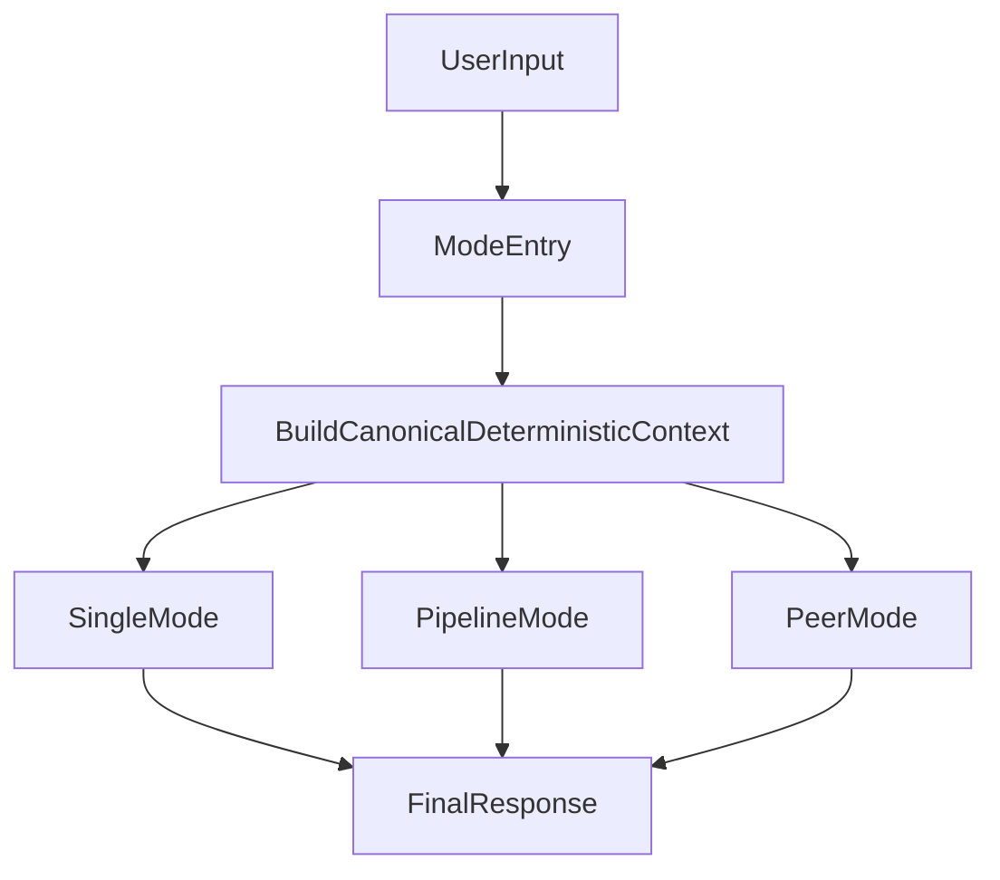
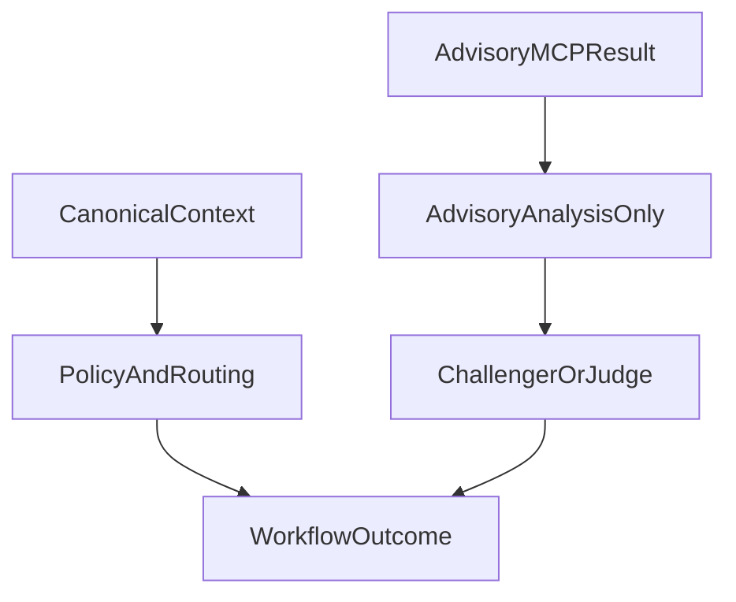

# Deterministic Retrieval, Graph Dictionary, and Advisory MCP

This document defines the deterministic retrieval architecture used by crisAI, including:

- canonical deterministic context across `single`, `pipeline`, and `peer` modes
- graph dictionary lifecycle (`registry/retrieval_association_graph.yaml`)
- advisory read-only MCP lookup (`expand_associations`)
- precedence, fail-open behavior, and observability

---

## 1. Purpose

Deterministic retrieval exists to reduce prompt fragility and make source discovery behavior reproducible.

The runtime computes a canonical context once per run from:

- user intent text
- retrieval association graph
- bounded graph expansion settings (`max_hops`, `max_terms`)

That canonical context is then reused by workflow stages.

---

## 2. Canonical Context Model

Defined in `src/crisai/orchestration/retrieval_association_graph.py`:

- `schema_version` (currently `deterministic_context_v1`)
- `activated_topic_ids`
- `suggested_terms`
- `suggested_sources`
- `graph_loaded`
- `graph_version`

The context is immutable and run-scoped.

---

## 3. Operating Mode Consistency

All modes use the same deterministic source of truth.

### 3.1 Single
- Context is built once before `retrieval_planner` execution.
- Prompt receives deterministic expansion block and structured handoff hints.

### 3.2 Pipeline
- Context is built once and reused by:
  - `retrieval_planner`
  - `context_retrieval`
- Trace emits deterministic metadata for observability.

### 3.3 Peer
- Context is built once and propagated to peer stages as read-only context.
- Advisory guidance can be enabled for review roles while preserving canonical precedence.

---

## 4. Graph Dictionary

Source file:

- `registry/retrieval_association_graph.yaml`

Structure:

- `settings.max_hops`
- `vertices` (`id`, `terms`)
- `edges`

Matching and expansion:

- terms with length >= 5: case-insensitive substring match
- shorter terms: case-insensitive word-boundary match
- BFS expansion within `max_hops`

Guidelines:

- keep vertex terms focused and lowercase
- prefer new vertices over oversized term lists
- keep edges sparse to avoid over-expansion
- treat graph as dictionary/config, not business logic

---

## 5. Advisory Read-Only MCP

Tool:

- `expand_associations` on workspace MCP server

Behavior:

- read-only
- returns advisory expansion payload (`advisory: true`)
- does not change canonical workflow policy or routing decisions

Fail-open:

- if advisory lookup is unavailable or fails, workflow continues with canonical deterministic context

Feature flag:

- `CRISAI_DETERMINISTIC_MCP_ADVISORY`

---

## 6. Precedence Rules

Canonical deterministic context is authoritative.

Advisory MCP output is supplementary only.

Policy and routing must not be silently overridden by advisory lookups.

---

## 7. Observability

Trace metadata includes:

- `schema_version`
- `graph_loaded`
- `graph_version`
- `activated_topics_count`
- `hint_terms_count`
- `suggested_sources`

Recommended event label:

- `DETERMINISTIC_RETRIEVAL_CONTEXT`

---

## 8. Key Files

- `src/crisai/orchestration/retrieval_association_graph.py`
- `src/crisai/cli/prompt_builders.py`
- `src/crisai/cli/pipelines.py`
- `src/crisai/cli/workflow_policy.py`
- `src/crisai/servers/workspace_server.py`
- `registry/retrieval_association_graph.yaml`
- `registry/servers.yaml`

---

## 9. Validation Targets

- `tests/unit/test_retrieval_association_graph.py`
- `tests/unit/test_prompt_builders.py`
- `tests/unit/test_workflow_policy.py`
- `tests/unit/test_workspace_server_search.py`
- `tests/cli/test_pipelines.py`
