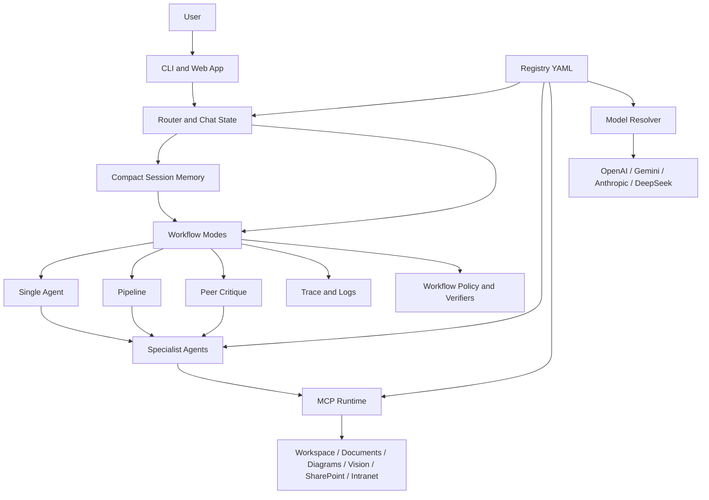
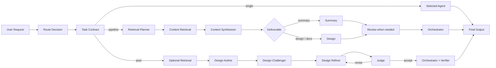

# crisAI

> **A local AI workstation for architecture, design, documentation, research, and controlled multi-agent critique.**

crisAI is a registry-driven local workstation that combines specialist agents, MCP tools, local and Microsoft Graph-backed retrieval, structured workflow modes, and provider-aware model assignment.

Use it to find source material, reason over it, draft architecture or documentation outputs, challenge those outputs through peer-style critique, and keep generated artefacts grounded in inspectable sources.

## What It Provides

- CLI and web app surfaces for the same routed workflows.
- Specialist agents with separate responsibilities and configurable model assignment.
- Local workspace, document, diagram, vision, SharePoint document, and scoped intranet content MCP servers.
- Native DOCX/PPTX export from reviewed Markdown task artefacts via template manifests.
- Three workflow modes: `single`, `pipeline`, and `peer`.
- Task contracts that preserve the user’s main ask across retrieval, summary, design, review, and final stages.
- Compact task memory for sessions, so long tasks keep useful context without replaying the full transcript every turn.
- Clean CLI and web stage rendering that separates readable agent prose from structured evidence metadata in traces.
- Source-fit validation so retrieved content must match explicit title and source-scope constraints before it is summarized.
- Deterministic retrieval expansion from registry dictionaries.
- Runtime policy gates for intranet-grounded work and file-producing workflows.
- Peer judge/verifier controls for higher-effort architecture work.
- Task-backed sessions, route visibility, logs, workspace browsing, and validation commands.

For the full operator manual, see [DOCUMENTATION.md](DOCUMENTATION.md). For deterministic retrieval internals, see [DOCUMENTATION_DETERMINISTIC_RETRIEVAL.md](DOCUMENTATION_DETERMINISTIC_RETRIEVAL.md).

## High-Level Architecture



## Workflow Shape



## Repository Map

```text
registry/     Agent, server, model, routing, policy, and retrieval dictionaries
prompts/      Agent prompt files and prompt-authoring guidance
src/crisai/   CLI, web app, orchestration, MCP servers, runtime, and validation code
tests/        Network-free unit, CLI, and orchestration regression tests
workspace/    Knowledge base, task workspaces, staged knowledge, outputs, sessions, and caches
runbooks/     Operational setup, security, registry, policy, and observability notes
```

## Requirements

- Python 3.10+
- Linux, macOS, or WSL on Windows
- `OPENAI_API_KEY` for OpenAI-backed agents
- Optional: Gemini, Anthropic, or DeepSeek keys when selected in `registry/models.yaml`
- Optional: Microsoft Entra app registration for SharePoint document retrieval and SharePoint-backed intranet retrieval

## Quick Install

```bash
git clone https://github.com/crissdiamond/crisAI
cd crisAI
python3 -m venv .venv
source .venv/bin/activate
pip install --upgrade pip
pip install -e .
cp .env.example .env
```

Set at least:

```dotenv
OPENAI_API_KEY=your_openai_api_key
CRISAI_DEFAULT_MODEL=gpt-5.4-mini
CRISAI_WORKSPACE_DIR=./workspace
CRISAI_LOG_DIR=./logs
CRISAI_REGISTRY_DIR=./registry
CRISAI_VISION_MODEL=gpt-4o-mini   # vision MCP server model; defaults to gpt-4o-mini if unset
```

For local development, tests, linting, and type checks:

```bash
pip install -e ".[dev]"
```

For Gemini or Anthropic through LiteLLM-backed integration:

```bash
pip install -e ".[litellm]"
```

## Start

```bash
crisai doctor
./start cli
```

For the web app:

```bash
./start web
```

Then open [http://127.0.0.1:8000](http://127.0.0.1:8000).

## First Commands

Inside the CLI:

```text
/status
/list servers
/list agents
/help
```

Example one-off request:

```bash
python -m crisai.cli.main ask -m "Find the most relevant document for integration strategy and summarise it."
```

## Workflow Modes

| Mode | Purpose |
|---|---|
| `single` | Run one selected specialist agent for bounded work. |
| `pipeline` | Retrieve, synthesize, summarize or design, optionally review, then orchestrate. |
| `peer` | Run author, challenger, refiner, judge, bounded revise loops, and final verification. |

Use `/mode auto` to let the router decide, or pin a mode with `/mode single`, `/mode pipeline`, or `/mode peer`.

## Configuration

The registry is the main control plane:

- `registry/agents.yaml`: agent ids, prompts, allowed MCP servers, and model refs.
- `registry/examples/agents.*.yaml`: mono-provider agent assignment examples.
- `registry/models.yaml`: provider-specific model names and API key env vars.
- `registry/servers.yaml`: MCP server definitions and allowed tools.
- `registry/workflow_policy.yaml`: runtime hard gates.
- `registry/workspace_spaces.yaml`: workspace roots, task artefact folders, promotion roots, and architecture vocabulary.
- `registry/session_memory.yaml`: compact session memory defaults, with `.env` overrides via `CRISAI_SESSION_MEMORY_*`.
- `registry/semantic_catalog.yaml`: legacy router, verifier, peer-contract terms, shared prompt lexicon, and retrieval source-fit constraints.
- `registry/semantic_graph.yaml`: task intent, deliverable, source-resolution, source-family, and retrieval topic expansion.

Run `crisai doctor` after registry edits.
Run `crisai doctor --models` after model/provider edits to dry-build configured agent models without making API calls.

## Retrieval Sources

crisAI can retrieve from:

- Approved local architecture knowledge under `workspace/knowledge/`.
- Active task artefacts and inputs under `workspace/tasks/<task>/`.
- Staged knowledge promotion candidates under `workspace/knowledge_staging/`.
- Local user files and generated outputs under `workspace/outputs/`.
- Supported local documents such as `.md`, `.txt`, `.csv`, `.docx`, `.pdf`, `.pptx`, and `.xlsx`; PowerPoint files expose slide-level text, tables, and extraction coverage.
- Standalone workspace images and embedded PowerPoint pictures through the `vision` MCP server.
- SharePoint / OneDrive documents through delegated Microsoft Graph, with opaque read handles, PowerPoint inspection tools, and validated evidence handoffs to prevent ID transcription errors.
- Published intranet pages through the scoped intranet MCP. The default provider is SharePoint Site Pages; custom providers can adapt wiki-style intranets.

For latest/master document summaries, crisAI asks for source confirmation when modified-date and version/master signals conflict instead of guessing.

## Workspace Model

crisAI separates team-owned knowledge from task work:

- `workspace/knowledge/` is the curated, approved, machine-readable knowledge base used for retrieval.
- `workspace/tasks/<task>/` is the working space for one task session. Agents write Markdown/Mermaid source artefacts under `artefacts/` and can reuse them as context later in the same task.
- `workspace/knowledge_staging/` is the review area for content promoted from task artefacts or generated from source documentation.

Markdown is the authoritative generated artefact format. Native Word, PowerPoint, Excel, email, JSON, and diagram exports should be generated later from reviewed Markdown and organisation templates.

For DOCX/PPTX output, the `document_formatter` agent uses `document_export`
tools to inspect a template manifest and render from an existing Markdown task
artefact into `workspace/tasks/<task>/exports/` or `workspace/outputs/`.
Starter UCL manifests live under `workspace/knowledge/templates/ucl/`; add
official binary `.docx` or `.pptx` templates beside those manifests when
available.

SharePoint documents and SharePoint-backed intranet pages use separate MCP servers and separate token caches. Full Graph setup, auth behavior, and prompting guidance are in [DOCUMENTATION.md](DOCUMENTATION.md).

## Testing

Install dev dependencies first:

```bash
pip install -e ".[dev]"
pytest
```

Static checks:

```bash
ruff check .
mypy src
```

See [TESTING.md](TESTING.md) for the suite layout and manual Graph login smoke test.

## Logs

Logs default to `./logs`:

```text
agent_trace.jsonl
crisai.log
workspace_mcp.log
document_mcp.log
diagram_mcp.log
sharepoint_mcp.log
intranet_mcp.log
vision_mcp.log
```

`agent_trace.jsonl` keeps stage text readable and stores raw machine artifacts,
such as validated evidence bundles, under structured event metadata.

## More Documentation

- [DOCUMENTATION.md](DOCUMENTATION.md): full operator manual.
- [DOCUMENTATION_DETERMINISTIC_RETRIEVAL.md](DOCUMENTATION_DETERMINISTIC_RETRIEVAL.md): deterministic retrieval architecture.
- [TESTING.md](TESTING.md): test suite and development checks.
- [reference/decisions/](reference/decisions/): crisAI product and engineering design decisions.
- [runbooks/](runbooks): setup, registry, policies, observability, and security.
- [prompts/README.md](prompts/README.md): prompt authoring guidance.

## Licence

crisAI is released under the MIT License. See [LICENSE](LICENSE).
