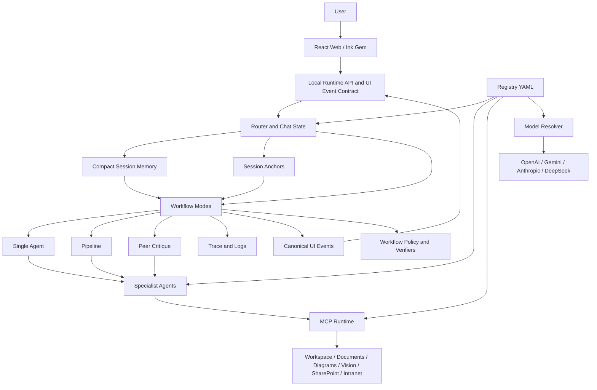
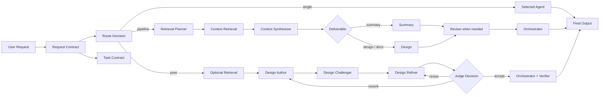

# crisAI

> **A local AI workstation for architecture, design, documentation, research, and controlled multi-agent critique.**

crisAI is a registry-driven local workstation that combines specialist agents, MCP tools, local and Microsoft Graph-backed retrieval, structured workflow modes, and provider-aware model assignment.

Use it to find source material, reason over it, draft architecture or documentation outputs, challenge those outputs through peer-style critique, and keep generated artefacts grounded in inspectable sources.

## What It Provides

- React web and Ink Gem terminal surfaces for the same routed workflows.
- Shared UI event contracts for routing, task contracts, streamed stage deltas, checkpoints, final answers, and run state.
- Specialist agents with separate responsibilities and configurable model assignment.
- Local workspace, document, diagram, vision, SharePoint document, and scoped intranet content MCP servers.
- Native DOCX/PPTX export from reviewed Markdown task artefacts via template manifests.
- Three workflow modes: `single`, `pipeline`, and `peer`.
- Task contracts that preserve the user’s main ask across retrieval, summary, design, review, and final stages.
- Compact task memory for sessions, so long tasks keep useful context without replaying the full transcript every turn.
- Deterministic session anchors for prior options, sections, risks, decisions, and recommendations, so follow-up requests like “use option 2 and 3” preserve the labels already shown to the user.
- Latest-message routing and policy inference, so task scaffolding informs context without changing the current ask.
- Clean CLI and web stage rendering that separates readable agent prose from structured evidence metadata in traces.
- Source-fit validation so retrieved content must match explicit title and source-scope constraints before it is summarized.
- Deterministic retrieval expansion from registry dictionaries.
- Runtime policy gates for intranet-grounded work and file-producing workflows.
- Peer judge/verifier controls for higher-effort architecture work.
- Task-backed sessions, route visibility, logs, workspace browsing, and validation commands.

For the full operator manual, see [DOCUMENTATION.md](DOCUMENTATION.md). For deterministic retrieval internals, see [DOCUMENTATION_DETERMINISTIC_RETRIEVAL.md](DOCUMENTATION_DETERMINISTIC_RETRIEVAL.md).

## High-Level Architecture



## Workflow Shape



## Repository Map

```text
registry/     Agent, server, model, routing, policy, and retrieval dictionaries
prompts/      Agent prompt files and prompt-authoring guidance
src/crisai/   CLI, web app/API, orchestration, MCP servers, runtime, schemas, and validation code
tests/        Network-free unit, CLI, and orchestration regression tests
workspace/    Knowledge base, task workspaces, staged knowledge, outputs, sessions, and caches
runbooks/     Operational setup, security, registry, policy, and observability notes
ui/           Future React web and Ink Gem clients plus shared TypeScript UI contracts
```

## Requirements

- Python 3.10+
- Node.js and npm for the React web and Ink Gem clients
- Linux, macOS, or WSL on Windows
- `OPENAI_API_KEY`, `GEMINI_API_KEY`, and `DEEPSEEK_API_KEY` for the default multi-provider agent registry
- Optional: Anthropic key when selected in `registry/models.yaml` or a mono-provider example
- Optional: Microsoft Entra app registration for SharePoint document retrieval and SharePoint-backed intranet retrieval

## Quick Install

```bash
git clone https://github.com/crissdiamond/crisAI
cd crisAI
python3 -m venv .venv
source .venv/bin/activate
pip install --upgrade pip
pip install -e ".[litellm]"
npm --prefix ui install
cp .env.example .env
```

Set the keys used by the default `registry/agents.yaml`:

```dotenv
OPENAI_API_KEY=your_openai_api_key
GEMINI_API_KEY=your_gemini_api_key
DEEPSEEK_API_KEY=your_deepseek_api_key
CRISAI_DEFAULT_MODEL=gpt-5.4-mini
CRISAI_WORKSPACE_DIR=./workspace
CRISAI_LOG_DIR=./logs
CRISAI_REGISTRY_DIR=./registry
CRISAI_VISION_MODEL=gpt-4o-mini   # vision MCP server model; defaults to gpt-4o-mini if unset
```

The default registry intentionally mixes OpenAI, Gemini, and DeepSeek. To run
with one provider, copy one of the mono-provider examples over
`registry/agents.yaml`, then set only that provider's key:

```bash
cp registry/examples/agents.openai.yaml registry/agents.yaml
```

For local development, tests, linting, and type checks:

```bash
pip install -e ".[dev]"
```

The `dev` extra includes LiteLLM support because the default registry uses
LiteLLM-backed Gemini and DeepSeek models.

## Start

Run the FastAPI backend first, then attach a client:

```bash
crisai doctor
./start api          # FastAPI backend on http://127.0.0.1:8000
./start gem          # Ink terminal client (separate terminal window)
# or
./start web          # React/Vite web client at http://127.0.0.1:5173
```

For the Ink Gem and React web clients, the UI workspace dependencies must be
installed once:

```bash
npm --prefix ui install
```

If the FastAPI runtime is protected with a static bearer token, set
`CRISAI_API_KEY` in `.env`. The `./start web` launcher maps it to
`VITE_CRISAI_API_KEY` for Vite, and `./start gem` passes it to Ink Gem.
The launcher also maps `CRISAI_RUNTIME_URL` to `VITE_CRISAI_RUNTIME_URL` for
local `.env` convenience. React web can also upload local source documents into
the current task inputs folder or the knowledge intake area for later retrieval.

## hcom Development Team

For multi-agent development, crisAI includes an hcom operating model with one
top-level Codex orchestrator and paired Codex/Claude area agents for runtime,
Gem, and web work.

```bash
scripts/hcom_start.sh --dry-run   # inspect launch commands
scripts/hcom_start.sh             # launch the hcom team
scripts/hcom_start.sh --resume    # resume previous hcom/provider sessions
scripts/hcom_status.sh            # show local assignments and agent status
scripts/hcom_stop.sh              # stop crisAI hcom agent tags
```

The helper scripts use repo-local hcom state in `.hcom/` and write generated
session mappings to `reference/development/session_assignments.local.yaml`.
Both are ignored by git. Stable role definitions live under
`reference/development/`; the top-level `runtime/`, `gem/`, and `web/` folders
are hcom launch folders, not source roots.

Use `--resume` only when continuing the same development context. The launcher
resumes a role by `provider_session_id` when present in the assignment file, or
by the previous hcom session name otherwise. Missing previous sessions fall back
to fresh launches. Successful launches record provider session UUIDs when hcom
exposes them.

`scripts/hcom_stop.sh` snapshots the active hcom/provider session IDs before
stopping the team, so the next `scripts/hcom_start.sh --resume` can restore the
same agent sessions where the provider still supports resume.

In WSL, `scripts/hcom_start.sh` opens hcom shells in Windows Terminal when
`wt.exe` is available, otherwise it falls back to `tmux`. Override this with
`--terminal PRESET_OR_COMMAND` or `HCOM_TEAM_TERMINAL`, for example:

```bash
scripts/hcom_start.sh --terminal tmux
```

## First Commands

Inside the CLI:

```text
/status
/list servers
/list agents
/help
```

Example one-off request:

```bash
python -m crisai.cli.main ask -m "Find the most relevant document for integration strategy and summarise it."
```

## Workflow Modes

| Mode | Purpose |
|---|---|
| `single` | Run one selected specialist agent for bounded work. |
| `pipeline` | Retrieve, pause for source confirmation, synthesize, summarize or design, optionally review, then orchestrate. |
| `peer` | Run author, challenger, refiner, judge, bounded revise loops, and final verification. |

Use `/mode auto` to let the router decide, or pin a mode with `/mode single`, `/mode pipeline`, or `/mode peer`.

For Solution Architects, Data Architects, and Enterprise Architects, use
`pipeline` for source-grounded drafting and summarisation, and use `peer` when
the output needs challenged judgement: options papers, HLDs, ADRs, target-state
recommendations, roadmap trade-offs, governance models, and architecture review
findings. crisAI is a support tool for producing high-quality, UCL-customised
drafts from local templates and approved knowledge; architects remain accountable
for final decisions, stakeholder alignment, and publication.

Pipeline retrieval checkpoints are enabled by default. After retrieval, the CLI
and web app show a concise evidence brief before downstream summary or design
stages run. The user can continue, redirect retrieval, or stop the run. Disable
per run with `--no-retrieval-checkpoint`, in chat with
`/retrieval-checkpoint off`, or by setting
`CRISAI_RETRIEVAL_CHECKPOINT_ENABLED=false`.

Terminal-title updates are disabled by default; enable them with
`CRISAI_TERMINAL_TITLE_ENABLED=true` only if your terminal handles OSC title
sequences cleanly.

## Configuration

The registry is the main control plane:

- `registry/agents.yaml`: agent ids, prompts, allowed MCP servers, and model refs.
- `registry/examples/agents.*.yaml`: mono-provider agent assignment examples.
- `registry/models.yaml`: provider-specific model names and API key env vars.
- `registry/servers.yaml`: MCP server definitions and allowed tools.
- `registry/workflow_policy.yaml`: runtime hard gates.
- `registry/workspace_spaces.yaml`: workspace roots, named knowledge corpora, task artefact folders, promotion roots, and architecture vocabulary.
- `registry/session_memory.yaml`: compact session memory defaults, with `.env` overrides via `CRISAI_SESSION_MEMORY_*`.
- `registry/semantic_catalog.yaml`: legacy router, verifier, peer-contract terms, shared prompt lexicon, retrieval source-fit constraints, and generic session-anchor vocabulary used to preserve user-visible labels across follow-up turns.
- `registry/semantic_graph.yaml`: task intent, deliverable, source-resolution, source-family, and retrieval topic expansion.

Run `crisai doctor` after registry edits.
Run `crisai doctor --models` after model/provider edits to dry-build configured agent models without making API calls.

## Retrieval Sources

crisAI can retrieve from:

- Approved local architecture knowledge under `workspace/knowledge/`.
- Active task artefacts and inputs under `workspace/tasks/<task>/`.
- Staged knowledge promotion candidates under `workspace/knowledge_staging/`.
- Local user files and generated outputs under `workspace/outputs/`.
- Supported local documents such as `.md`, `.txt`, `.csv`, `.docx`, `.pdf`, `.pptx`, and `.xlsx`; PowerPoint files expose slide-level text, tables, and extraction coverage.
- Standalone workspace images and embedded PowerPoint pictures through the `vision` MCP server.
- SharePoint / OneDrive documents through delegated Microsoft Graph, with opaque read handles, PowerPoint inspection tools, and validated evidence handoffs to prevent ID transcription errors.
- Published intranet pages through the scoped intranet MCP. The default provider is SharePoint Site Pages; custom providers can adapt wiki-style intranets.

For latest/master document summaries, crisAI asks for source confirmation when modified-date and version/master signals conflict instead of guessing.

## Workspace Model

crisAI separates team-owned knowledge from task work:

- `workspace/knowledge/` is the curated, approved, machine-readable knowledge base used for retrieval.
- `workspace/tasks/<task>/` is the working space for one task session. Agents write Markdown/Mermaid source artefacts under `artefacts/` and can reuse them as context later in the same task.
- `workspace/knowledge_staging/` is the review area for content promoted from task artefacts or generated from source documentation.

The physical names are configurable in `registry/workspace_spaces.yaml`.
Knowledge is declared as named corpora with roots, access mode, aliases,
retrieval priority, and promotion targets. The default corpora are
`approved_knowledge` (`workspace/knowledge/`) and `staged_knowledge`
(`workspace/knowledge_staging/`). Prompts and task output use the configured
knowledge roots.

Agents do not write to `workspace/knowledge/` by default. If the user explicitly requests an exact `workspace/knowledge/...` output path, that path is authorized for that run only and must be the path that changes; writing a substitute under `knowledge_staging/` fails policy validation.

Markdown is the authoritative generated artefact format. Native Word, PowerPoint, Excel, email, JSON, and diagram exports should be generated later from reviewed Markdown and organisation templates.

Reusable task deliverables such as options papers, architecture recommendations, assessments, and HLDs are persisted under the active task's `artefacts/` folder when they would otherwise only exist in chat. The task manifest tracks generated artefacts automatically. Retrieval is scoped to approved knowledge plus the active task by default; sibling task sessions are only used when the user names them explicitly.

Generated templated Markdown is checked deterministically against `registry/workspace_artifact_profiles.yaml` before it is registered. When an artefact declares `template_path`, crisAI loads that template, checks the generated document has the template sections, and applies any template-declared conformance rules such as required diagrams or placeholder handling.

Task sessions also maintain `.crisai/anchors.json`. This file records user-visible anchors extracted from prior assistant outputs, such as option numbers, section labels, risk numbers, decisions, and recommendation labels. Later requests that refer to those labels are resolved before agent execution and passed as authoritative runtime context; generated artefacts must preserve the resolved labels and titles.

For DOCX/PPTX output, the `document_formatter` agent uses `document_export`
tools to inspect a template manifest and render from an existing Markdown task
artefact into `workspace/tasks/<task>/exports/` or `workspace/outputs/`.
Starter UCL manifests live under `workspace/knowledge/templates/ucl/`; add
official binary `.docx` or `.pptx` templates beside those manifests when
available.

SharePoint documents and SharePoint-backed intranet pages use separate MCP servers and separate token caches. Full Graph setup, auth behavior, and prompting guidance are in [DOCUMENTATION.md](DOCUMENTATION.md).

## Testing

Install dev dependencies first:

```bash
pip install -e ".[dev]"
pytest
```

Static checks:

```bash
ruff check .
mypy src
```

See [TESTING.md](TESTING.md) for the suite layout and manual Graph login smoke test.

## Logs

Logs default to `./logs`:

```text
agent_trace.jsonl
crisai.log
workspace_mcp.log
document_mcp.log
diagram_mcp.log
sharepoint_mcp.log
intranet_mcp.log
vision_mcp.log
```

`agent_trace.jsonl` keeps stage text readable and stores raw machine artifacts,
such as validated evidence bundles, under structured event metadata.

## More Documentation

- [DOCUMENTATION.md](DOCUMENTATION.md): full operator manual.
- [DOCUMENTATION_DETERMINISTIC_RETRIEVAL.md](DOCUMENTATION_DETERMINISTIC_RETRIEVAL.md): deterministic retrieval architecture.
- [TESTING.md](TESTING.md): test suite and development checks.
- [reference/VISION.md](reference/VISION.md): product vision and guiding principles.
- [reference/TODO.md](reference/TODO.md): maintainable backlog of future improvements.
- [reference/decisions/](reference/decisions/): crisAI product and engineering design decisions.
- [runbooks/](runbooks): setup, registry, policies, observability, and security.
- [prompts/README.md](prompts/README.md): prompt authoring guidance.

## Licence

crisAI is released under the MIT License. See [LICENSE](LICENSE).
