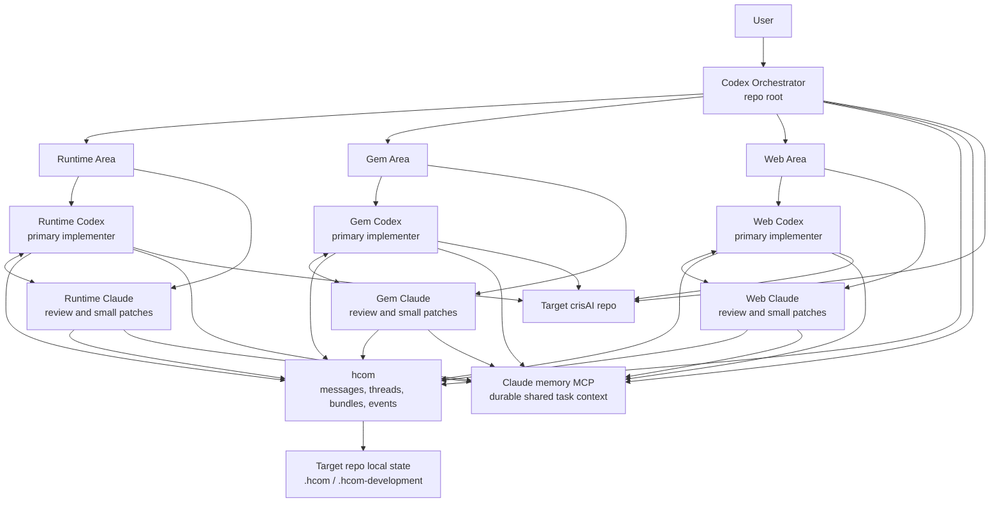

# crisAI Development Team

Reusable hcom operating model for coordinating a Codex-led multi-agent
development team.

The default shape is:

- one top-level Codex orchestrator;
- runtime Codex + Claude pair;
- Gem Codex + Claude pair;
- web Codex + Claude pair.

Codex is the primary coder. Claude agents challenge, review, and may make small
focused patches inside their assigned area. The Claude memory MCP server is the
shared durable context layer across agent streams; hcom is used for concise
coordination and bundles.

## Architecture



## Repository Use

This directory is designed to become its own repository, for example:

```bash
mkdir ../crisAI-development-team
cp -R development-team/. ../crisAI-development-team/
cd ../crisAI-development-team
git init
git add .
git commit -m "feat: add hcom development team"
```

From that repo, launch against a target crisAI checkout:

```bash
scripts/hcom_start.sh --target-repo /path/to/crisAI --dry-run
scripts/hcom_start.sh --target-repo /path/to/crisAI
scripts/hcom_status.sh --target-repo /path/to/crisAI
scripts/hcom_stop.sh --target-repo /path/to/crisAI
```

If this package lives inside the target repo, `--target-repo` can be omitted.

In WSL, the launcher opens hcom shells in Windows Terminal when `wt.exe` is
available, otherwise it falls back to `tmux`. Override this with
`--terminal PRESET_OR_COMMAND` or `HCOM_TEAM_TERMINAL`, for example:

```bash
scripts/hcom_start.sh --target-repo /path/to/crisAI --terminal tmux
```

## Local State

The scripts use target-repo local hcom state:

- `<target-repo>/.hcom/`
- `<target-repo>/.hcom-development/session_assignments.local.yaml`

Both should be ignored by the target repository. This package includes
`.gitignore.example` entries to copy into the target repo if needed.

## Requirements

- `hcom`
- `codex`
- `claude`
- Claude memory MCP server available to launched agents

## Files

- `reference/development/operating_model.md`: team workflow.
- `reference/development/agent_roster.yaml`: stable roles and ownership.
- `reference/development/roles/`: role bootstrap prompts.
- `launch/runtime`, `launch/gem`, `launch/web`: hcom launch folders.
- `scripts/hcom_start.sh`: launch the team.
- `scripts/hcom_status.sh`: show status and local session assignments.
- `scripts/hcom_stop.sh`: stop hcom tags for this team.
