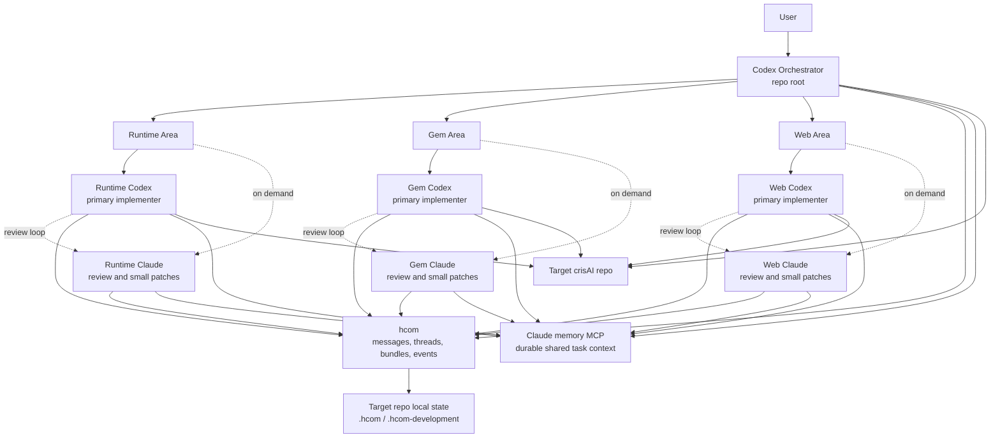

# crisAI Development Team

Reusable hcom operating model for coordinating a Codex-led multi-agent
development team.

The default shape is:

- one top-level Codex orchestrator;
- runtime, Gem, and web Codex implementers;
- on-demand Claude reviewers launched by the orchestrator when useful.

Codex is the primary coder. Claude reviewers challenge, review, and may make
small focused patches inside their assigned area when the orchestrator launches
them. The Claude memory MCP server is the shared durable context layer across
agent streams; hcom is used for concise coordination and bundles.

## Claude Memory MCP

Claude memory MCP is a required part of this development-team setup. It is the
shared memory layer for all hcom streams, so agents do not need to replay long
transcripts or rely only on their current provider session.

Use memory for:

- user goals, constraints, and success criteria;
- active task assignments and ownership boundaries;
- design decisions and their rationale;
- implementation summaries and changed areas;
- review conclusions, risks, and unresolved blockers.

Do not store secrets, API keys, auth tokens, or private credential material.
hcom should carry short coordination messages and bundle references; Claude
memory should carry durable project context.

## Architecture



## Repository Use

This directory is designed to become its own repository, for example:

```bash
mkdir ../crisAI-development-team
cp -R development-team/. ../crisAI-development-team/
cd ../crisAI-development-team
git init
git add .
git commit -m "feat: add hcom development team"
```

From that repo, launch against a target crisAI checkout:

```bash
scripts/hcom_start.sh --target-repo /path/to/crisAI --dry-run
scripts/hcom_start.sh --target-repo /path/to/crisAI
scripts/hcom_start.sh --target-repo /path/to/crisAI --resume
scripts/hcom_start.sh --target-repo /path/to/crisAI --no-tool-auto-approve
scripts/hcom_status.sh --target-repo /path/to/crisAI
scripts/hcom_stop.sh --target-repo /path/to/crisAI
```

Always pass `--target-repo` when using the packaged scripts against an existing
crisAI checkout. If omitted, the packaged script treats the development-team
repository itself as the target repository.

Tool auto-approval is enabled by default for launched agents. Use
`--no-tool-auto-approve` or `HCOM_TEAM_TOOL_AUTO_APPROVE=0` when interactive
Codex/Claude tool approval is required.

By default, `scripts/hcom_start.sh` launches the standing Codex team only. Set
`HCOM_TEAM_CLAUDE_MODE=persistent` to launch legacy always-on Claude reviewers.
The recommended model is ephemeral Claude review:

```bash
scripts/hcom_claude_review.sh --target-repo /path/to/crisAI --role gem_claude --thread gem-ui-review --task "Review the Gem UI diff and report UX risks."
scripts/hcom_claude_status.sh --target-repo /path/to/crisAI
scripts/hcom_claude_close.sh --target-repo /path/to/crisAI --thread gem-ui-review
```

`HCOM_TEAM_CLAUDE_VISIBILITY=headless` is the default. Use `tmux` only when a
temporary visible Claude pane is useful. The orchestrator decides when to close
Claude reviewers, normally after the related task is pushed, abandoned, or no
longer likely to need follow-up.

The orchestrator Codex is the only Git writer and launches with
`HCOM_TEAM_ORCHESTRATOR_CODEX_SANDBOX=danger-full-access` by default so `.git`
metadata is writable for commits and pushes. Area Codex agents keep
`HCOM_TEAM_AREA_CODEX_SANDBOX=workspace-write` and must hand off Git writes to
the orchestrator.

The launcher uses `tmux` by default when available. Override this with
`--terminal PRESET_OR_COMMAND` or `HCOM_TEAM_TERMINAL`, for example:

```bash
scripts/hcom_start.sh --target-repo /path/to/crisAI --terminal 'wt.exe -w 0 new-tab --title hcom -- wsl.exe -d Ubuntu bash {script}'
```

The default tmux session is `crisai-hcom`; override it with
`HCOM_TEAM_TMUX_SESSION`. The tmux windows are created in this order:

1. `orchestrator(<hcom_name>)`
2. `gem_codex(<hcom_name>)`
3. `web_codex(<hcom_name>)`
4. `run_codex(<hcom_name>)`

Persistent Claude mode adds Claude reviewer windows.

Attach with the helper:

```bash
scripts/hcom_attach.sh
```

Or attach directly with:

```bash
tmux attach -t crisai-hcom
```

Inside tmux, switch between agent windows with `Ctrl-\` then the window number,
`Ctrl-\` then `n` or `p` for next/previous, or `Ctrl-\` then `w` for the window
list. Detach without stopping agents with `Ctrl-\` then `d`. `Ctrl-b` remains a
secondary prefix if needed. The tmux status area uses two fixed bottom lines:
the first lists agents and the second shows command help. The orchestrator is
dark purple, Codex area agents are blue, Claude area agents are dark grey, and
the selected window is bold.

## Local State

The scripts use target-repo local hcom state:

- `<target-repo>/.hcom/`
- `<target-repo>/.hcom-development/session_assignments.local.yaml`

Use `--resume` only when continuing the same active team context. The launcher
resumes each role by `provider_session_id` when present in the assignment file,
or by the previous hcom session name otherwise. Missing previous sessions fall
back to fresh launches. Successful launches record provider session UUIDs when
hcom exposes them.

`scripts/hcom_stop.sh` snapshots the active hcom/provider session IDs before
stopping the team, so the next `scripts/hcom_start.sh --target-repo /path/to/crisAI --resume`
can restore the same agent sessions where the provider still supports resume.
With the default `tmux` backend, hcom manages the team panes without touching
unrelated WSL or Windows Terminal sessions.

Both should be ignored by the target repository. This package includes
`.gitignore.example` entries to copy into the target repo if needed.

## Requirements

- `hcom`
- `codex`
- `claude` for on-demand or persistent Claude reviewers
- `tmux` for the default managed terminal backend
- Claude memory MCP server available to launched agents

## Files

- `reference/development/operating_model.md`: team workflow.
- `reference/development/agent_roster.yaml`: stable roles and ownership.
- `reference/development/roles/`: role bootstrap prompts.
- `launch/runtime`, `launch/gem`, `launch/web`: hcom area context folders.
- `scripts/hcom_start.sh`: launch the team.
- `scripts/hcom_claude_review.sh`: launch an ephemeral Claude reviewer.
- `scripts/hcom_claude_status.sh`: inspect active Claude reviewers.
- `scripts/hcom_claude_close.sh`: close Claude reviewers by name, role, thread,
  or expired lease.
- `scripts/hcom_status.sh`: show status and local session assignments.
- `scripts/hcom_stop.sh`: stop hcom tags for this team.
- `scripts/hcom_tmux_terminal.sh`: create named tmux windows for launched
  agents.
