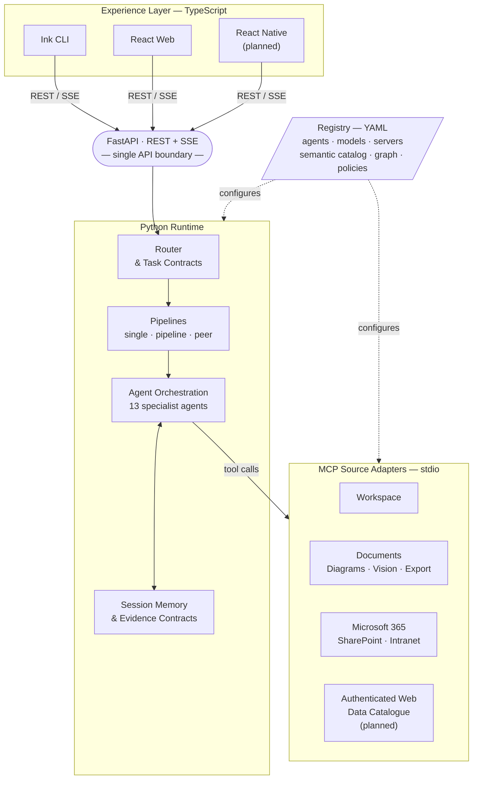

# crisAI Vision

crisAI is a local AI workstation for enterprise, solution, and data architecture
work. It is designed to help architects perform daily work with better context,
better traceability, and less repetitive effort.

The goal is not to build a general chatbot. The goal is to build a practical
architecture assistant that can retrieve trusted source material, reason over it
through narrowly scoped specialist agents, produce useful artefacts, challenge
its own outputs, and keep the user in control.

As crisAI matures, its scope should extend beyond design assistance into the
enterprise architecture process space. The workstation should help architects
prepare, route, review, assure, sign off, and publish architecture artefacts
through governed workflows. That process support must remain human-accountable:
crisAI can prepare evidence, coordinate review packs, track states, and surface
decisions, but it should not replace the people or governance bodies responsible
for formal architecture assurance.

## Product Vision

crisAI should become the workstation architects use to move from scattered
enterprise knowledge to grounded architecture outputs.

It should help with tasks such as:

- finding and summarising documents, decks, standards, intranet pages, and
  architecture repositories;
- drafting high-level designs, options papers, architecture decisions, data
  architecture notes, integration designs, and review packs;
- comparing options and making assumptions, trade-offs, risks, and decisions
  explicit;
- reusing curated organisation knowledge without replaying noisy chat history;
- turning reviewed Markdown and diagrams into standard business documents;
- preparing architecture artefacts for review, assurance, sign-off, and
  publication through controlled workflows;
- keeping enough evidence and trace metadata to explain where an answer came
  from.

crisAI should feel like a workstation of specialist colleagues rather than one
large assistant. Each agent should have a narrow responsibility, a clear tool
scope, and an independently configurable model.

## Target Users

The primary users are architects and technical leaders who work across enterprise
systems and information sources:

- enterprise architects;
- solution architects;
- data architects;
- integration architects;
- platform and product architects;
- technical leads preparing design or governance material.

The tool should support real daily activities: reviewing a design, drafting a
decision paper, summarising a strategy deck, finding standards, checking an
integration pattern, preparing a governance response, or shaping a data/reporting
architecture.

## Product Principles

### 1. Grounded Before Fluent

Useful architecture work depends on source fidelity. crisAI should prefer a
slower, grounded answer over a fluent but unsupported one.

Retrieval evidence, source identity, read status, gaps, and caveats should be
handled as structured transport, not mixed into user-facing prose.

### 2. Narrow Agents, Clear Boundaries

More focused agents are preferable to fewer broad agents. Retrieval, context
synthesis, summary, design, critique, judging, publishing, and formatting should
remain separate roles when their responsibilities differ.

An agent should only see the tools and context it needs for its role.

### 3. User Control At Costly Decisions

The user should remain in control at points where a wrong choice would waste
time, money, or credibility. Retrieval confirmation, source selection,
publication, export, and knowledge promotion should be explicit and inspectable.

### 4. Semantics Belong In Configuration

Intent semantics, routing language, source hints, synonyms, task contracts, and
policy vocabulary should live in registry files rather than being scattered
through Python code.

Python should provide reliable mechanics. The registry should describe behaviour
that teams need to tune.

### 5. Local First, Enterprise Connected

crisAI should work as a local workstation with local files, logs, sessions, and
workspace artefacts. It should connect to enterprise sources through scoped MCP
servers with explicit authentication and least-privilege tool access.

Microsoft 365 support is important, but the architecture should remain provider
neutral. Organisations should be able to add Confluence, authenticated websites,
data catalogues, wikis, and other repositories without changing the core
workflow model.

### 6. Markdown As Source, Native Documents As Output

Markdown and Mermaid should remain the source of truth for generated architecture
artefacts because they are diffable, reviewable, and easy to validate. DOCX,
PPTX, PDF, and image outputs should be generated from reviewed source artefacts.

### 7. Observable Cost And Quality

The workstation should make cost, token usage, model choice, routing decisions,
source gaps, and quality gates visible. Architecture teams should be able to
understand why a run behaved the way it did and where money was spent.

## Architecture Direction

crisAI should evolve around these stable building blocks:

- **Registry-driven configuration** for agents, models, servers, semantics,
  policies, memory, and workspace spaces.
- **MCP source adapters** for local workspace files, documents, diagrams, vision,
  Microsoft 365, intranet pages, authenticated websites, and data catalogues.
- **Task contracts** that preserve the user's main ask across retrieval,
  synthesis, drafting, review, and final response.
- **Evidence contracts** that carry machine-readable source evidence separately
  from human-readable prose.
- **Task workspaces** that store artefacts, exports, memory, traces, and
  decisions for each piece of work.
- **Governed knowledge spaces** where curated patterns, standards, decisions,
  and templates can be promoted deliberately.
- **Architecture process spaces** that model roles, responsibilities, review
  states, sign-off expectations, and accountable human handoffs for architecture
  governance.
- **CLI and web surfaces** that expose the same routing, stage, checkpoint, and
  trace semantics.

The diagram below shows how these building blocks relate and where the key
architectural boundary sits.

The experience layer and the Python runtime evolve independently. Any new client
surface — a VS Code extension, a Teams bot, a CI integration — connects via the
same FastAPI boundary without touching the runtime or the MCP adapters. The
registry drives the behaviour of both the runtime and the source adapters, so
tuning routing, agents, models, or source capabilities remains a configuration
change rather than a code change.

## Technology Decisions

The choices below are deliberate. Do not propose alternatives without strong
justification — they were selected for architectural coherence, not convenience.

- **Runtime — Python**: All agent orchestration, pipeline execution, routing,
  registry loading, and MCP adapter code is Python. The runtime evolves
  independently of the experience layer.
- **API boundary — FastAPI (REST + SSE)**: The single integration point between
  any experience surface and the Python runtime. New surfaces connect here; they
  do not reach into the runtime or adapters directly.
- **Experience layer — TypeScript**: The target surfaces are React (web), Ink
  (CLI, planned), and React Native (mobile, planned). Shared API call logic and
  component model reduce duplication across surfaces. The current CLI is
  Python/Typer and the current web front end is static HTML/CSS/JS served by
  FastAPI — both are migration targets, not the target architecture.
- **Source adapters — MCP over stdio**: Each source category (workspace,
  documents, Microsoft 365, authenticated web) has its own MCP server. The
  runtime issues tool calls; adapters are stateless and independently
  deployable. Do not route source access through HTTP endpoints or direct
  library calls.
- **Configuration — YAML registry**: Agent definitions, model assignments,
  semantic vocabulary, intent routing, and source adapter configuration all
  live in YAML under `registry/`. Behaviour changes are registry edits, not
  code changes. Do not hardcode routing terms, intent patterns, or agent
  parameters in Python source.
- **Artefact format — Markdown + Mermaid**: All generated architecture artefacts
  are authored and stored as Markdown with embedded Mermaid diagrams. DOCX,
  PPTX, PDF, and image formats are export outputs generated from reviewed
  Markdown, not source formats.
- **LLM access — Anthropic SDK**: The runtime communicates with language models
  through the Anthropic SDK. Each agent is assigned a Claude model via the
  registry. Do not introduce alternative LLM providers or SDKs without
  discussing the impact on the registry model and cost observability.

## Near-Term Direction

The near-term focus should be pipeline trust and UX:

1. Add a human checkpoint after retrieval.
2. Stream stage output.
3. Cache validated retrieval evidence.
4. Add cost and token tracking per stage.
5. Add a read-only OAuth/OIDC authenticated website MCP.

These changes reduce the biggest current sources of waste: wrong-source
continuation, opaque long-running stages, repeated retrieval, invisible model
spend, and missing access to protected enterprise web sources.

## Medium-Term Direction

The medium-term focus should be stronger enterprise and data architecture
support:

- architecture artefact template library;
- data catalogue MCP, with Microsoft Purview as a strong first candidate;
- Confluence intranet adapter;
- governed knowledge promotion;
- architecture roles, people, assurance, and sign-off designs before any
  automation of formal review workflows;
- architecture quality gates for assumptions, NFRs, data ownership, lineage,
  security, privacy, risks, decisions, and open questions.

## Non-Goals

crisAI should not become:

- an unbounded web browsing agent;
- a replacement for source systems of record;
- a hidden autonomous actor that writes or promotes knowledge without user
  confirmation;
- a replacement for architecture governance, review boards, accountable owners,
  or formal human sign-off;
- a single giant prompt with every responsibility mixed together;
- a document management system;
- a tool that hides evidence, costs, or model choices from the user.

## Success Criteria

crisAI is succeeding when:

- architects can produce grounded first drafts faster;
- source selection and evidence gaps are visible before design work continues;
- generated architecture artefacts can be reviewed, diffed, exported, and reused;
- teams can tune agents, models, semantics, and source connectors without code
  changes for every organisation;
- cost and quality are measurable per stage;
- the tool improves daily architecture work without reducing professional
  accountability.
