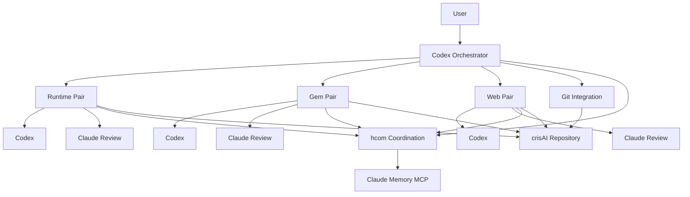

# crisAI Development Model

This area documents how crisAI is developed. It is intentionally separate from
the product README and operator documentation because crisAI itself also uses
multi-agent workflows at runtime. The development team described here is for
building the repository, not for using crisAI as an architecture workstation.

## Purpose

crisAI can be developed by a small hcom-coordinated team:

- one Codex orchestrator from the repository root;
- paired Codex and Claude agents for runtime, Gem, and web work;
- Claude memory MCP as the durable project context layer;
- hcom for short coordination messages, bundles, events, and terminal sessions.

Codex remains the main implementation agent. Claude agents review, challenge,
and make small focused patches when requested. The orchestrator owns planning,
cross-area coordination, final integration, and Git metadata writes.

## Architecture At A Glance



## Claude Memory MCP

Claude memory MCP is a required part of the development-team operating model.
It is the shared memory layer for all hcom streams, so agents do not need to
replay long transcripts or rely only on their current provider session.

Use memory for:

- user goals, constraints, and success criteria;
- active task assignments and ownership boundaries;
- design decisions and their rationale;
- implementation summaries and changed areas;
- review conclusions, risks, and unresolved blockers.

Do not store secrets, API keys, auth tokens, or private credential material.
hcom should carry short coordination messages and bundle references; Claude
memory should carry durable project context.

## Registry-Owned Semantics

Semantic behaviour must be configured, not hardcoded. Development agents should
treat this as a design principle, not as a preference.

- Runtime code may implement loaders, validators, and mechanics.
- Semantic vocabulary belongs in `registry/semantic_catalog.yaml` or
  `registry/semantic_graph.yaml`.
- Do not hardcode routing terms, intent patterns, verifier regexes, prompt
  lexicon terms, retrieval constraints, retrieval expansion terms, deliverable
  names, or source-family vocabulary in Python.
- If a change needs new task language, retrieval language, contract markers, or
  classification terms, update the registry and tests around registry loading or
  behaviour.
- If an agent proposes hardcoded semantic lists in Python, reviewers should send
  it back for registry-driven implementation before integration.

## Start Here

- [Operating model](operating_model.md): responsibilities, launch flow,
  session resume, Git authority, memory use, and UI definition of done.
- [Agent roster](agent_roster.yaml): stable roles, ownership boundaries, and
  shared rules.
- [Role prompts](roles/): bootstrap instructions for each hcom-launched agent.
- [UI engineering contract](ui_engineering_contract.md): expectations for Gem,
  web, and shared UI contract work.
- [Handoff template](handoff_template.md): compact area handoff format.
- [Review template](review_template.md): review format for Claude reviewers.

## Common Commands

Fresh team launch:

```bash
scripts/hcom_start.sh
```

Stop and save resumable session information:

```bash
scripts/hcom_stop.sh
```

Continue the same team context:

```bash
scripts/hcom_start.sh --resume
```

Show hcom state and local role assignments:

```bash
scripts/hcom_status.sh
```

Use `--resume` only when continuing the same development context. For new work,
prefer a fresh launch and rely on Claude memory plus the role documents for
shared context.

## Packaged Team Repository

The `development-team/` directory is a reusable copy of the same operating
model. It can be copied into its own repository and launched against a target
crisAI checkout:

```bash
scripts/hcom_start.sh --target-repo /path/to/crisAI
scripts/hcom_start.sh --target-repo /path/to/crisAI --resume
scripts/hcom_stop.sh --target-repo /path/to/crisAI
```

See [development-team/README.md](../../development-team/README.md) for the
packaged-team form.
