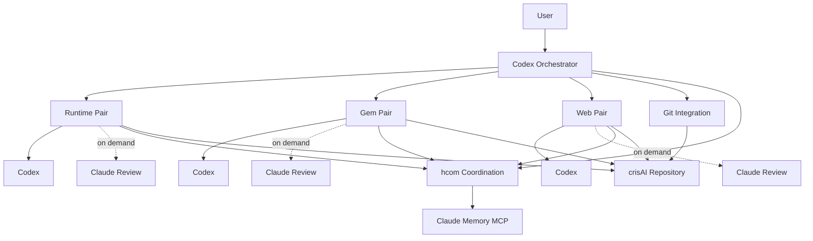

# crisAI Development Model

This area documents how crisAI is developed. It is intentionally separate from
the product README and operator documentation because crisAI itself also uses
multi-agent workflows at runtime. The development team described here is for
building the repository, not for using crisAI as an architecture workstation.

## Purpose

crisAI can be developed by a small hcom-coordinated team:

- one Codex orchestrator from the repository root;
- runtime, Gem, and web Codex implementers;
- on-demand reviewers for review-required runtime, Gem, and web work, with
  Claude as the mandatory gate by default;
- Claude memory MCP as the durable project context layer;
- hcom for short coordination messages, bundles, events, and terminal sessions.

Codex remains the main implementation agent. Reviewers are launched by the
orchestrator as mandatory gates for review-required work, and may make small
focused patches when requested. If a required Claude reviewer cannot launch, the
task pauses unless the user explicitly overrides. The orchestrator owns
planning, cross-area coordination, final integration, Git metadata writes, and
reviewer lifecycle.

## Architecture At A Glance



## Claude Memory MCP

Claude memory MCP is a required part of the development-team operating model.
It is the shared memory layer for all hcom streams, so agents do not need to
replay long transcripts or rely only on their current provider session.

Use memory for:

- user goals, constraints, and success criteria;
- active task assignments and ownership boundaries;
- design decisions and their rationale;
- implementation summaries and changed areas;
- review conclusions, risks, and unresolved blockers.

Do not store secrets, API keys, auth tokens, or private credential material.
hcom should carry short coordination messages and bundle references; Claude
memory should carry durable project context.

## Registry-Owned Semantics

Semantic behaviour must be configured, not hardcoded. Development agents should
treat this as a design principle, not as a preference.

- Runtime code may implement loaders, validators, and mechanics.
- Semantic vocabulary belongs in `registry/semantic_catalog.yaml` or
  `registry/semantic_graph.yaml`.
- Do not hardcode routing terms, intent patterns, verifier regexes, prompt
  lexicon terms, retrieval constraints, retrieval expansion terms, deliverable
  names, or source-family vocabulary in Python.
- If a change needs new task language, retrieval language, contract markers, or
  classification terms, update the registry and tests around registry loading or
  behaviour.
- If an agent proposes hardcoded semantic lists in Python, reviewers should send
  it back for registry-driven implementation before integration.

## Start Here

- [Operating model](operating_model.md): responsibilities, launch flow,
  session resume, Git authority, memory use, and UI definition of done.
- [Agent roster](agent_roster.yaml): stable roles, ownership boundaries, and
  shared rules.
- [Review provider design](review_provider_design.md): how to extend review
  providers without weakening the Claude review gate.
- [Role prompts](roles/): bootstrap instructions for each hcom-launched agent.
- [UI engineering contract](ui_engineering_contract.md): expectations for Gem,
  web, and shared UI contract work.
- [Handoff template](handoff_template.md): compact area handoff format.
- [Review template](review_template.md): review format for Claude reviewers.

Default development-team terminal management requires `tmux`. Windows Terminal
can still be used by overriding `--terminal`, but the managed default is tmux.

## Common Commands

Fresh team launch:

```bash
scripts/hcom_start.sh
```

By default, launched Codex and reviewer agents use non-bypass tool auto-approval
so they can proceed without repeated permission prompts. The default team launch
starts Codex agents only; reviewers are ephemeral unless
`HCOM_TEAM_REVIEW_LIFECYCLE=persistent` is set. `HCOM_TEAM_CLAUDE_MODE` still
works as a deprecated compatibility alias for the lifecycle setting. Disable
auto-approval when you want interactive tool approval:

```bash
scripts/hcom_start.sh --no-tool-auto-approve
```

The orchestrator Codex is the only Git writer and launches with
`HCOM_TEAM_ORCHESTRATOR_CODEX_SANDBOX=danger-full-access` by default so `.git`
metadata is writable for commits and pushes. Area Codex agents keep
`HCOM_TEAM_AREA_CODEX_SANDBOX=workspace-write` and must hand off Git writes to
the orchestrator.

Stable hcom base names are configured in
`reference/development/team_names.yaml`. The launcher reads that registry and
passes the configured name to hcom with `--hcom-name` on fresh launches. Override
the registry path with `HCOM_TEAM_NAMES_REGISTRY` when testing a different
mapping.

Choose the reviewer provider independently with
`HCOM_TEAM_REVIEW_PROVIDER=claude-code|antigravity`. Claude Code is the default.
Antigravity is supported when its reusable OAuth token is already present. The
starter sets the persisted Antigravity model in
`~/.gemini/antigravity-cli/settings.json` before launching reviewers, then
verifies the active model with an `agy --print` probe. This avoids manual
`/model` switching before each team launch.
Launch a default reviewer for review-required work:

```bash
scripts/hcom_review.sh --role runtime_review --thread runtime-review --task "Review the runtime diff and report risks."
scripts/hcom_review_status.sh
scripts/hcom_review_close.sh --thread runtime-review
```

Use `./start hcom agy` when you want on-demand reviewers to use Antigravity, and
`./start hcom all-up agy` when you want persistent reviewer sessions through
Antigravity. These default to the Claude reviewer profile. Use
`./start hcom agy gemini` or `./start hcom all-up agy gemini` to set and verify
the Gemini reviewer profile before launch. If Antigravity prompts for OAuth, run
`agy` once manually and retry after it can reopen without asking for
authentication.

`HCOM_TEAM_CLAUDE_VISIBILITY=headless` is the default. The orchestrator may keep
a reviewer alive across related sequential tasks, but should close it after the
related task is pushed, abandoned, or unlikely to need follow-up.
Claude Code prompt suggestions are disabled for reviewer sessions by default
with `CLAUDE_CODE_ENABLE_PROMPT_SUGGESTION=false`; set
`HCOM_TEAM_CLAUDE_PROMPT_SUGGESTIONS=true` only if you explicitly want Claude's
idle prompt suggestions visible while debugging reviewer panes.
If the reviewer cannot launch or exits during startup, treat that as no review:
pause before commit, report the exact provider or startup error, and retry only
when the blocker is resolved or the user explicitly overrides the gate.

Stop and save resumable session information:

```bash
scripts/hcom_stop.sh
```

The launcher uses `tmux` by default when available, so hcom can close managed
team panes without touching unrelated WSL or Windows Terminal sessions. The
default tmux session is `crisai-hcom`; override it with
`HCOM_TEAM_TMUX_SESSION`.

The tmux windows are created in this order:

1. `orchestrator(cris)`
2. `gem_codex(lina)`
3. `web_codex(luke)`
4. `run_codex(bili)`

Persistent Claude mode adds `gem_claude(alex)`, `web_claude(lori)`, and
`run_claude(alle)`.

Attach to the team session with the helper:

```bash
scripts/hcom_attach.sh
```

Or attach directly with:

```bash
tmux attach -t crisai-hcom
```

Inside tmux, switch between agent windows with `Ctrl-\` then the window number,
`Ctrl-\` then `n` or `p` for next/previous, or `Ctrl-\` then `w` for the window
list. Detach without stopping agents with `Ctrl-\` then `d`. `Ctrl-b` remains a
secondary prefix if needed. The tmux status area uses two fixed bottom lines:
the first lists agents and the second shows command help. The orchestrator is
dark purple, Codex area agents are blue, Claude area agents are dark grey, and
the selected window is bold.

Start or continue the team context:

```bash
./start hcom
```

`./start hcom` resumes saved hcom sessions when local assignments exist,
otherwise it starts a fresh team. Use `./start hcom-attach` to attach to the
managed tmux session. Use `scripts/hcom_start.sh` directly when you want
advanced flags such as `--dry-run`, `--headless`, or `--no-tool-auto-approve`.

Show hcom state and local role assignments:

```bash
scripts/hcom_status.sh
```

Use `--resume` only when continuing the same development context. For new work,
prefer a fresh launch and rely on Claude memory plus the role documents for
shared context.

## Packaged Team Repository

The `development-team/` directory is a reusable copy of the same operating
model. It can be copied into its own repository and launched against a target
crisAI checkout:

```bash
scripts/hcom_start.sh --target-repo /path/to/crisAI
scripts/hcom_start.sh --target-repo /path/to/crisAI --resume
scripts/hcom_stop.sh --target-repo /path/to/crisAI
```

When running the packaged scripts from this repository's embedded
`development-team/` directory, pass `--target-repo /home/diamond/crisAI` or run
the root scripts under `scripts/`. Without `--target-repo`, the packaged script
treats its own `development-team/` checkout as the target repository.

See [development-team/README.md](../../development-team/README.md) for the
packaged-team form.
